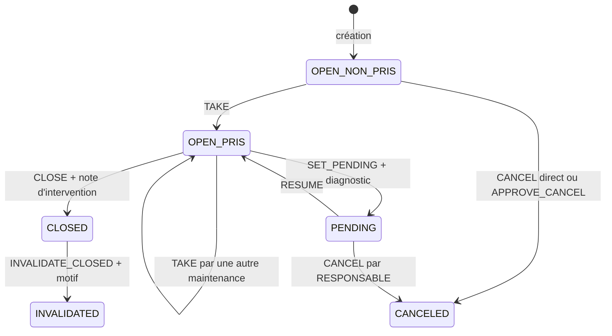

# Cycle de vie d'un incident Sentinel

## Statuts possibles

| Statut | Description |
|---|---|
| `OPEN` | Incident actif, en cours de traitement |
| `PENDING` | MAINTENANCE a mis en pause (en attente de pièces, d'informations, etc.) |
| `CLOSED` | Incident résolu par MAINTENANCE |
| `CANCELED` | Incident annulé (erreur de déclaration, etc.) |
| `INVALIDATED` | Clôture invalidée par RESPONSABLE ; état terminal conservé dans l'historique |

---

## Diagramme des transitions



`OPEN_NON_PRIS` et `OPEN_PRIS` représentent le même statut SQL `OPEN`, distingué ici par
la valeur de `is_taken`. `CLOSED`, `CANCELED` et `INVALIDATED` sont des états terminaux.

---

## Détail des transitions

### OPEN → OPEN (pris ou repris)
- **Qui** : MAINTENANCE uniquement
- **Action** : `TAKE`
- **Condition** : statut OPEN ; l'incident peut être non pris ou déjà pris par un autre technicien. Le technicien actuellement affecté ne peut pas répéter une prise en charge sans effet.
- **Effet** : `is_taken = true`, `taken_by_user_id = actorId`, avec journalisation du technicien précédent en cas de reprise

### OPEN (pris) → PENDING
- **Qui** : tout utilisateur MAINTENANCE
- **Action** : `SET_PENDING`
- **Condition** : statut OPEN, `is_taken = true`
- **Requis** : un diagnostic doit exister (saisi maintenant ou précédemment)
- **Effet** : statut passe à PENDING

### PENDING → OPEN (pris)
- **Qui** : tout utilisateur MAINTENANCE
- **Action** : `RESUME`
- **Condition** : statut PENDING, `is_taken = true`
- **Effet** : statut repasse à OPEN

### OPEN (pris) → CLOSED
- **Qui** : tout utilisateur MAINTENANCE
- **Action** : `CLOSE`
- **Condition** : statut OPEN, `is_taken = true` (pas depuis PENDING)
- **Requis** : une note d'intervention doit exister
- **Effet** : statut passe à CLOSED, incident archivé

### OPEN → CANCELED (direct)
- **Qui** : RESPONSABLE ou MAINTENANCE
- **Action** : `CANCEL`
- **Condition** : incident actif, `is_taken = false`
- **Effet** : statut passe à CANCELED

### OPEN → CANCELED (via demande)
- **Étape 1** : l'OPERATOR déclarant fait `REQUEST_CANCEL` avec un motif obligatoire, tant que l'incident est actif et non pris
- **Étape 2** : RESPONSABLE fait `APPROVE_CANCEL` → statut CANCELED
- **Alternative** : RESPONSABLE fait `REJECT_CANCEL` → incident reste OPEN

### PENDING → CANCELED (reprise de contrôle superviseur)
- **Qui** : RESPONSABLE uniquement (pas MAINTENANCE)
- **Action** : `CANCEL`
- **Condition** : statut PENDING (donc `is_taken = true` par construction)
- **Effet** : statut passe à CANCELED
- **Pourquoi MAINTENANCE en est exclu** : un incident PENDING a déjà été pris
  en charge par un technicien qui s'est engagé sur le diagnostic — l'annuler
  à ce stade est une décision de supervision, pas une opération technique.

### CLOSED → INVALIDATED
- **Qui** : RESPONSABLE uniquement
- **Action** : `INVALIDATE_CLOSED`
- **Condition** : statut CLOSED
- **Requis** : motif d'invalidation obligatoire
- **Effet** : statut passe à INVALIDATED ; l'incident reste historisé et n'est pas rouvert

---

## Workflow d'édition (demande de correction)

Quand un OPERATOR veut corriger un incident qu'il a déclaré :

```
OPERATOR : REQUEST_EDIT (envoie les champs modifiés)
                │
                ▼
       [edit_request stocké en base]
                │
         ┌──────┴──────┐
         │             │
         ▼             ▼
RESPONSABLE :   RESPONSABLE :
APPROVE_EDIT    REJECT_EDIT
         │             │
         ▼             ▼
  corrections      edit_request
  appliquées         effacé
```

---

## États de la machine (anomalies déclarées)

Ce sont les types d'anomalie qu'un OPERATOR peut déclarer, indépendamment du statut de l'incident :

| État | Description |
|---|---|
| `SKIPEE_PAR_MACHINE` | La machine skippe des pièces automatiquement |
| `SKIPEE_PAR_CONDUCTEUR` | Le conducteur skippe des pièces manuellement |
| `DEGRADEE` | La machine fonctionne en mode dégradé |
| `INDISPONIBLE` | La machine est complètement arrêtée |

---

## Règles importantes à retenir

1. **On ne peut pas clôturer un incident PENDING** — il faut d'abord le reprendre (RESUME) pour repasser en OPEN, puis clôturer.
2. **Seul MAINTENANCE peut prendre en charge** — RESPONSABLE supervise mais n'intervient pas techniquement.
3. **OPERATOR ne peut demander l'annulation que si l'incident n'est pas encore pris** — un incident OPEN déjà pris ne peut pas être annulé directement ; lorsqu'il est PENDING, seul RESPONSABLE peut l'annuler.
4. **Diagnostic obligatoire avant PENDING** — on ne peut pas mettre en attente sans avoir documenté le problème.
5. **Note d'intervention obligatoire avant CLOSE** — on ne peut pas clôturer sans avoir documenté ce qui a été fait.
6. **Toutes les transitions réussies génèrent un événement d'audit** — journal append-only au niveau applicatif, avec l'acteur et l'horodatage de l'action.
