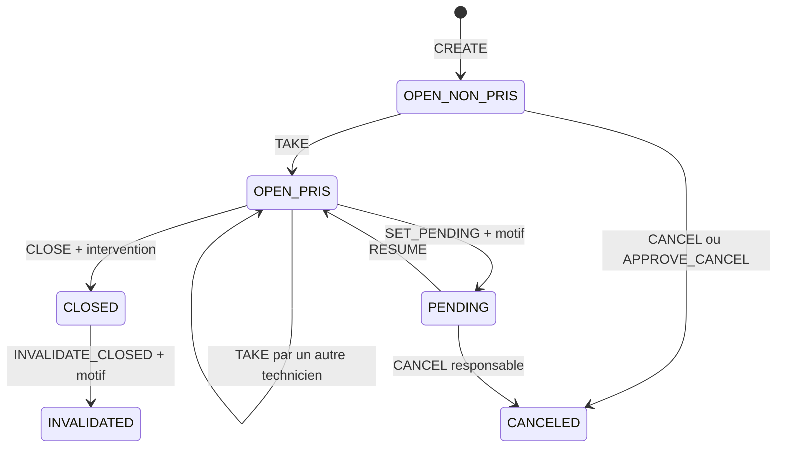

# Cycle de vie d'un incident Sentinel

Ce document décrit les transitions réellement autorisées par la policy backend
et protégées par les contraintes PostgreSQL.

## 1. Statuts

| Statut | Nature | Description |
| --- | --- | --- |
| `OPEN` | actif | incident à prendre ou en cours de traitement |
| `PENDING` | actif | traitement suspendu avec un motif de mise en attente |
| `CLOSED` | terminal | intervention clôturée avec une note |
| `CANCELED` | terminal | déclaration annulée, conservée dans l'historique |
| `INVALIDATED` | terminal | clôture invalidée par un responsable |

`OPEN` est complété par l'affectation :

- non pris : `is_taken=false`, technicien et date nuls ;
- pris : `is_taken=true`, `taken_by_user_id` et `taken_at` renseignés.

La base interdit les combinaisons incohérentes de ces trois champs.

## 2. Graphe principal

Une demande d'arbitrage ouverte bloque les mutations concurrentes qui rendraient
la décision ambiguë.

## 3. Transitions de traitement

### Création

- acteurs : `OPERATOR`, `MAINTENANCE` ou `RESPONSABLE` ;
- données : ligne, machine, robot, tête, état et produit, avec commentaire
  optionnel ;
- effets : statut `OPEN`, non pris, snapshot du déclarant et événement `CREATED` ;
- la création n'ajoute aucun suivi ; un responsable active volontairement le
  suivi avec l'étoile ;
- intégrité : une seule anomalie active par emplacement machine.

### `TAKE`

- acteur : `MAINTENANCE` ;
- condition : incident `OPEN` sans arbitrage ouvert ;
- comportement : revendique un incident non pris ou transfère un incident pris
  par un autre technicien ;
- no-op interdit : le technicien déjà affecté ne peut pas se réaffecter ;
- effets : technicien/date mis à jour et ancien technicien tracé en cas de transfert.

### `SET_PENDING`

- acteur : `MAINTENANCE` ;
- condition : incident `OPEN`, pris, sans arbitrage ouvert ;
- donnée requise : motif de mise en attente non vide ;
- effet : statut `PENDING`, affectation conservée et motif courant enregistré
  dans `waiting_reason`.

`diagnostic` demeure une colonne historique en lecture seule pour d'anciennes
données : aucune action de production actuelle ne l'écrit. `SET_PENDING` ne
l'exige pas et ne le modifie pas.

La policy autorise un technicien de maintenance remplaçant à suspendre un
incident déjà pris. Pour matérialiser aussi le transfert d'affectation, il doit
d'abord utiliser `TAKE`.

### `RESUME`

- acteur : `MAINTENANCE` ;
- condition : incident `PENDING`, pris, sans arbitrage ouvert ;
- effet : retour à `OPEN`, affectation conservée.

Tout technicien de maintenance peut reprendre afin de ne pas bloquer une équipe
en cas d'absence. Un transfert explicite peut ensuite être réalisé par `TAKE`.

### `CLOSE`

- acteur : `MAINTENANCE` ;
- condition : incident `OPEN`, pris, sans arbitrage ouvert ;
- donnée requise : note d'intervention présente ou fournie ;
- effet : statut `CLOSED`, date et acteur de clôture, événement historisé.

Un incident `PENDING` doit d'abord être repris. Comme pour `RESUME`, la policy
autorise une maintenance remplaçante à clôturer ; l'identité de l'acteur de
clôture reste distincte du technicien affecté.

### `CANCEL` direct

- acteurs : `RESPONSABLE` ou `MAINTENANCE` ;
- cas `OPEN` : uniquement si l'incident n'est pas pris et n'a pas d'arbitrage ;
- cas `PENDING` : uniquement `RESPONSABLE`, comme décision de supervision ;
- effet : statut `CANCELED`, conservation intégrale dans l'historique.

### `INVALIDATE_CLOSED`

- acteur : `RESPONSABLE` ;
- condition : incident `CLOSED` ;
- donnée requise : motif ;
- effet : statut `INVALIDATED`, sans réouverture de l'incident.

## 4. Demande d'annulation

### Ouverture

`REQUEST_CANCEL` est autorisé à l'opérateur déclarant si :

- l'incident est actif ;
- il n'est pas pris ;
- aucune autre demande d'arbitrage n'est ouverte ;
- un motif non vide est fourni.

La transaction met le marqueur de demande sur l'incident, écrit l'événement et
crée un cas `CANCEL/ACTIVE` avec demandeur, motif et date.

### Navigation du responsable

- ouverture de l'incident : la modale présente le contexte suffisant pour décider ;
- **Reporter** : ferme la modale, ne change pas le cas, puis montre le dossier ;
- **Consulter le dossier** : passe explicitement `ACTIVE` vers `CONSULTED` et
  montre le dossier ;
- fermeture par la croix/Escape : aucun changement métier.

Seul `ACTIVE` compte dans la pastille rouge « À arbitrer ». Une consultation du
dossier déclenchée en dehors du bouton d'arbitrage ne marque jamais le cas lu.

### Décision

- `APPROVE_CANCEL` : cas `APPROVED`, incident `CANCELED` ;
- `REJECT_CANCEL` : cas `REJECTED`, incident reste actif, demande effacée ;
- archivage/annulation globale rendant la demande obsolète : cas `SUPERSEDED`.

La décision et la transition de l'incident partagent la même transaction.

## 5. Demande de correction

### Ouverture

`REQUEST_EDIT` est autorisé à l'opérateur déclarant sur un incident actif sans
autre arbitrage. Seuls les champs explicitement demandés sont stockés dans le
payload du cas `EDIT/ACTIVE`; l'incident courant n'est pas modifié.

### Décision

- `APPROVE_EDIT` applique atomiquement les champs validés et clôt le cas en
  `APPROVED` ;
- `REJECT_EDIT` ne modifie pas l'incident et clôt le cas en `REJECTED` ;
- `WITHDRAW_EDIT` retire la demande du déclarant et clôt le cas en `WITHDRAWN`.

Le responsable voit côte à côte la valeur actuelle et la valeur demandée. Les
règles Reporter/Consulter/pastille sont identiques à l'annulation.

## 6. Modifications directes

- `RESPONSABLE_EDIT` : champs descriptifs d'un incident actif, même pris, en
  l'absence d'arbitrage ;
- `EDIT_AFTER_TAKE` : maintenance affectée uniquement, incident actif et pris ;
- `DIRECT_EDIT` : responsable ou maintenance sur un incident actif non pris ;
- `SET_PRIORITY` et `RESPONSIBLE_COMMENT` : responsable sur incident actif.

Une mise à jour qui ne change aucune valeur ne génère ni écriture ni événement
d'audit trompeur.

## 7. États de machine

Les états décrivent l'anomalie, indépendamment du statut de traitement :

| État | Description |
| --- | --- |
| `SKIPEE_PAR_MACHINE` | rejet automatique par la machine |
| `SKIPEE_PAR_CONDUCTEUR` | rejet manuel par le conducteur |
| `DEGRADEE` | production maintenue en mode dégradé |
| `INDISPONIBLE` | machine arrêtée |

## 8. Invariants

1. un incident terminal ne redevient jamais actif ;
2. un incident `PENDING` est toujours pris ;
3. une clôture exige une note d'intervention ;
4. une mise en attente exige un motif distinct du champ historique `diagnostic` ;
5. une demande opérateur concerne uniquement sa propre déclaration ;
6. un seul cas d'arbitrage ouvert existe par incident ;
7. toute mutation réussie écrit son acteur et son contexte historique ;
8. annulations et invalidations sont conservées mais exclues des indicateurs actifs ;
9. les services verrouillent les lignes avant décision pour empêcher les courses ;
10. le frontend reflète la policy, mais seule la vérification backend autorise l'action.
