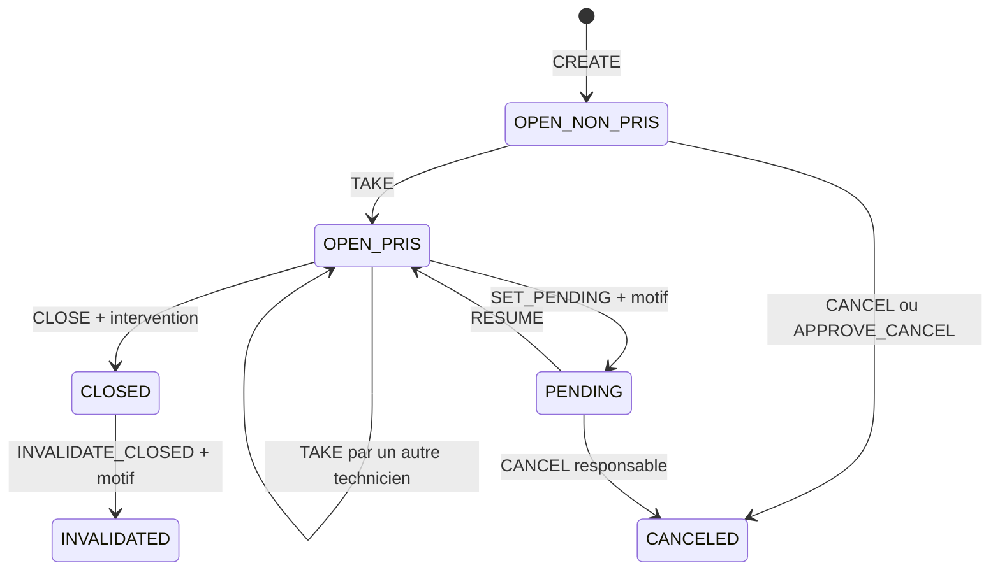

# Conception fonctionnelle Sentinel

**Périmètre :** référentiel, incidents atelier, arbitrage, pilotage et
capitalisation.

## 1. Finalité

Sentinel centralise le traitement d'une anomalie de production depuis sa
déclaration jusqu'à sa capitalisation. L'application doit répondre à quatre
questions opérationnelles :

1. où est le problème et quel est son impact ;
2. qui le prend en charge et depuis quand ;
3. quelle décision ou action est attendue ;
4. quelle solution pourra être réutilisée plus tard.

Le produit ne pilote pas directement les machines, ne remplace pas une GMAO
et ne fournit pas de supervision temps réel issue d'automates. Il structure
les décisions humaines et leur trace.

## 2. Espaces

| Espace | Public | Usage |
| --- | --- | --- |
| Portail `/login` | oui | choix Board, Administration ou Atelier |
| Board `/board` | code Board ou session Atelier | affichage lecture seule grand écran |
| Administration `/admin/*` | session Admin | référentiel, sécurité et audit |
| Atelier `/workshop/*` | session Atelier | incidents et vues métier |

Une session Atelier peut lire la projection Board. La réciproque est
impossible et les sessions Admin restent séparées.

## 3. Acteurs

### Administrateur

Compte système unique, hors rôles Atelier.

- crée, modifie, active, désactive et archive les comptes ;
- crée, modifie, active et archive les lignes/machines ;
- consulte les impacts avant une opération bloquante ;
- gère sécurité, e-mail, notifications et paramètres ;
- consulte les dashboards de qualité et l'audit consolidé ;
- traite les demandes de réinitialisation de mot de passe.

### Opérateur (`OPERATOR`)

- déclare un incident ;
- consulte l'avancement de ses propres déclarations ;
- demande une correction sur sa déclaration active ;
- demande une annulation tant que sa déclaration n'est pas prise ;
- consulte les vues Atelier autorisées.

### Maintenance (`MAINTENANCE`)

- déclare un incident ;
- prend ou transfère une prise en charge ;
- met en attente et reprend ;
- modifie un incident non pris ou celui qui lui est affecté ;
- clôture avec une note d'intervention ;
- annule directement un incident actif non pris.

### Responsable (`RESPONSABLE`)

- déclare un incident ;
- arbitre correction et annulation ;
- priorise et ajoute une consigne ;
- modifie les informations descriptives d'un incident actif ;
- annule un incident non pris ou reprend le contrôle d'un incident en
  attente ;
- invalide une clôture avec motif ;
- suit des incidents ;
- accède seul au journal transverse (le Pilotage, comme le Dashboard et la
  Connaissance, est accessible aux trois rôles Atelier — voir
  [design.md](design.md) §4.3).

## 4. Authentification

### Atelier

Chaque compte Atelier possède un badge et un mot de passe. À la création ou
lors d'une réinitialisation, l'admin remet un code temporaire ; l'utilisateur
choisit son mot de passe au premier accès. Le code expire et ne peut être
réutilisé.

Le badge est une chaîne composée uniquement de chiffres. Les zéros initiaux
sont conservés et significatifs.

Une désactivation, suppression, rotation de mot de passe ou modification de
badge ou de rôle invalide les sessions concernées via `session_version`.

### Admin

Le premier admin est amorcé sur une base vide. Ensuite, son identifiant et
son mot de passe sont gérés depuis l'application. Les actions sensibles
demandent une réauthentification, sans créer une nouvelle session parallèle.
Quatre mots de passe erronés refusent seulement l'action ; le cinquième
révoque toutes les sessions Admin. L'identifiant Admin ne peut pas être
uniquement numérique afin de ne jamais entrer en collision avec un badge
Atelier.

### Board

Le code local est comparé à un hash bcrypt. La session est limitée dans le
temps, révocable par version et ne donne accès qu'à la projection Board. Un
utilisateur Atelier déjà connecté peut aussi lire cette projection sans
obtenir de nouveau droit.

## 5. Administration des comptes

### Création

Données : prénom, nom, badge numérique, rôle, e-mail optionnel et
activation. Le badge actif est unique après retrait des espaces
périphériques ; `0012` et `12` restent deux identifiants distincts.

La création produit un code de setup remis une fois et un événement d'audit
avec snapshot de l'identité cible.

### Modification

- mise à jour des données et du rôle ;
- suppression des no-op : aucune trace si aucune valeur ne change ;
- conflit badge détecté côté service et garanti par PostgreSQL ;
- changement de rôle bloqué si l'utilisateur porte des incidents actifs ;
- changement de badge ou de rôle révoquant immédiatement les sessions
  Atelier.

### Activation, désactivation, archivage

L'API verrouille le compte et recalcule son impact dans la même transaction.
Une désactivation ou un archivage sont refusés si des incidents actifs sont
encore affectés à l'utilisateur. L'archivage anonymise les données
personnelles tout en conservant les snapshots historiques.

## 6. Référentiel lignes et machines

Une ligne contient un numéro, un état actif et une séquence ordonnée de
machines. Une machine contient au minimum un identifiant, une marque et une
configuration simple ou double robot avec nombres de têtes bornés.

Règles :

- numéro de ligne numérique, actif et unique après retrait des espaces
  périphériques ; les zéros initiaux sont significatifs ;
- identifiant machine unique dans tout le référentiel actif ;
- payload machine validé côté formulaire, Zod et PostgreSQL ;
- conflits recalculés sous transaction au moment de l'écriture ;
- numéro, séquence/configuration des machines et désactivation gelés en
  présence d'incidents actifs ;
- archivage forcé explicite possible selon l'impact affiché et les droits.

Le backend conserve l'ordre JSON attendu par l'interface et une projection
SQL normalisée synchronisée par trigger pour garantir l'unicité concurrente.

## 7. Incident

### Données

| Domaine | Informations |
| --- | --- |
| Emplacement | ligne, machine, marque, robot, tête |
| Production | état d'anomalie, produit en cours |
| Déclaration | commentaire, déclarant, rôle, date |
| Traitement | statut, technicien, prise, motif de mise en attente, diagnostic historique en lecture seule, intervention |
| Pilotage | priorité, consigne responsable, ordre stable |
| Arbitrage | demande, demandeur, payload/motif, consultation, décision |
| Historique | snapshots et événements horodatés |

États d'anomalie : `SKIPEE_PAR_MACHINE`, `SKIPEE_PAR_CONDUCTEUR`,
`DEGRADEE`, `INDISPONIBLE`.

Statuts : `OPEN`, `PENDING`, `CLOSED`, `CANCELED`, `INVALIDATED`.

## 8. Cycle de vie détaillé d'un incident

Cette section décrit les transitions réellement autorisées par la policy
backend et protégées par les contraintes PostgreSQL — c'est le contrat de
référence, pas une simplification pédagogique.

### 8.1 Statuts

| Statut | Nature | Description |
| --- | --- | --- |
| `OPEN` | actif | incident à prendre ou en cours de traitement |
| `PENDING` | actif | traitement suspendu avec un motif de mise en attente |
| `CLOSED` | terminal | intervention clôturée avec une note |
| `CANCELED` | terminal | déclaration annulée, conservée dans l'historique |
| `INVALIDATED` | terminal | clôture invalidée par un responsable |

`OPEN` est complété par l'affectation : non pris (`is_taken=false`,
technicien et date nuls) ou pris (`is_taken=true`, `taken_by_user_id` et
`taken_at` renseignés). La base interdit les combinaisons incohérentes de
ces trois champs.

### 8.2 Graphe principal

Une demande d'arbitrage ouverte bloque les mutations concurrentes qui
rendraient la décision ambiguë.

### 8.3 Transitions de traitement

**Création.** Acteurs : `OPERATOR`, `MAINTENANCE` ou `RESPONSABLE`. Données :
ligne, machine, robot, tête, état et produit, avec commentaire optionnel.
Effets : statut `OPEN`, non pris, snapshot du déclarant et événement
`CREATED`. La création n'ajoute aucun suivi ; un responsable active
volontairement le suivi avec l'étoile. Intégrité : une seule anomalie active
par emplacement machine.

**`TAKE`.** Acteur : `MAINTENANCE`. Condition : incident `OPEN` sans
arbitrage ouvert. Comportement : revendique un incident non pris ou
transfère un incident pris par un autre technicien. No-op interdit : le
technicien déjà affecté ne peut pas se réaffecter. Effets : technicien/date
mis à jour et ancien technicien tracé en cas de transfert.

**`SET_PENDING`.** Acteur : `MAINTENANCE`. Condition : incident `OPEN`,
pris, sans arbitrage ouvert. Donnée requise : motif de mise en attente non
vide. Effet : statut `PENDING`, affectation conservée et motif courant
enregistré dans `waiting_reason`. `diagnostic` demeure une colonne
historique en lecture seule pour d'anciennes données : aucune action de
production actuelle ne l'écrit. `SET_PENDING` ne l'exige pas et ne le
modifie pas. La policy autorise un technicien de maintenance remplaçant à
suspendre un incident déjà pris ; pour matérialiser aussi le transfert
d'affectation, il doit d'abord utiliser `TAKE`.

**`RESUME`.** Acteur : `MAINTENANCE`. Condition : incident `PENDING`, pris,
sans arbitrage ouvert. Effet : retour à `OPEN`, affectation conservée. Tout
technicien de maintenance peut reprendre afin de ne pas bloquer une équipe en
cas d'absence ; un transfert explicite peut ensuite être réalisé par `TAKE`.

**`CLOSE`.** Acteur : `MAINTENANCE`. Condition : incident `OPEN`, pris, sans
arbitrage ouvert. Donnée requise : note d'intervention présente ou fournie.
Effet : statut `CLOSED`, date et acteur de clôture, événement historisé. Un
incident `PENDING` doit d'abord être repris. Comme pour `RESUME`, la policy
autorise une maintenance remplaçante à clôturer ; l'identité de l'acteur de
clôture reste distincte du technicien affecté.

**`CANCEL` direct.** Acteurs : `RESPONSABLE` ou `MAINTENANCE`. Cas `OPEN` :
uniquement si l'incident n'est pas pris et n'a pas d'arbitrage. Cas
`PENDING` : uniquement `RESPONSABLE`, comme décision de supervision. Effet :
statut `CANCELED`, conservation intégrale dans l'historique.

**`INVALIDATE_CLOSED`.** Acteur : `RESPONSABLE`. Condition : incident
`CLOSED`. Donnée requise : motif. Effet : statut `INVALIDATED`, sans
réouverture de l'incident.

### 8.4 Demande d'annulation

**Ouverture.** `REQUEST_CANCEL` est autorisé à l'opérateur déclarant si
l'incident est actif, n'est pas pris, qu'aucune autre demande d'arbitrage
n'est ouverte, et qu'un motif non vide est fourni. La transaction met le
marqueur de demande sur l'incident, écrit l'événement et crée un cas
`CANCEL/ACTIVE` avec demandeur, motif et date.

**Navigation du responsable.** Ouverture de l'incident : la modale présente
le contexte suffisant pour décider. **Reporter** : ferme la modale, ne
change pas le cas, puis montre le dossier. **Consulter le dossier** : passe
explicitement `ACTIVE` vers `CONSULTED` et montre le dossier. Fermeture par
la croix/Escape : aucun changement métier. Seul `ACTIVE` compte dans la
pastille rouge « À arbitrer ». Une consultation du dossier déclenchée en
dehors du bouton d'arbitrage ne marque jamais le cas lu.

**Décision.** `APPROVE_CANCEL` : cas `APPROVED`, incident `CANCELED`.
`REJECT_CANCEL` : cas `REJECTED`, incident reste actif, demande effacée.
Archivage/annulation globale rendant la demande obsolète : cas
`SUPERSEDED`. La décision et la transition de l'incident partagent la même
transaction.

### 8.5 Demande de correction

**Ouverture.** `REQUEST_EDIT` est autorisé à l'opérateur déclarant sur un
incident actif sans autre arbitrage. Seuls les champs explicitement demandés
sont stockés dans le payload du cas `EDIT/ACTIVE` ; l'incident courant n'est
pas modifié.

**Décision.** `APPROVE_EDIT` applique atomiquement les champs validés et
clôt le cas en `APPROVED`. `REJECT_EDIT` ne modifie pas l'incident et clôt
le cas en `REJECTED`. `WITHDRAW_EDIT` retire la demande du déclarant et clôt
le cas en `WITHDRAWN`. Le responsable voit côte à côte la valeur actuelle et
la valeur demandée ; les règles Reporter/Consulter/pastille sont identiques
à l'annulation.

### 8.6 Modifications directes

- `RESPONSABLE_EDIT` : champs descriptifs d'un incident actif, même pris, en
  l'absence d'arbitrage ;
- `EDIT_AFTER_TAKE` : maintenance affectée uniquement, incident actif et
  pris ;
- `DIRECT_EDIT` : responsable ou maintenance sur un incident actif non
  pris ;
- `SET_PRIORITY` et `RESPONSIBLE_COMMENT` : responsable sur incident actif.

Une mise à jour qui ne change aucune valeur ne génère ni écriture ni
événement d'audit trompeur.

### 8.7 États de machine

Les états décrivent l'anomalie, indépendamment du statut de traitement.

| État | Description |
| --- | --- |
| `SKIPEE_PAR_MACHINE` | rejet automatique par la machine |
| `SKIPEE_PAR_CONDUCTEUR` | rejet manuel par le conducteur |
| `DEGRADEE` | production maintenue en mode dégradé |
| `INDISPONIBLE` | machine arrêtée |

### 8.8 Invariants du cycle de vie

1. un incident terminal ne redevient jamais actif ;
2. un incident `PENDING` est toujours pris ;
3. une clôture exige une note d'intervention ;
4. une mise en attente exige un motif distinct du champ historique
   `diagnostic` ;
5. une demande opérateur concerne uniquement sa propre déclaration ;
6. un seul cas d'arbitrage ouvert existe par incident ;
7. toute mutation réussie écrit son acteur et son contexte historique ;
8. annulations et invalidations sont conservées mais exclues des
   indicateurs actifs ;
9. les services verrouillent les lignes avant décision pour empêcher les
   courses ;
10. le frontend reflète la policy, mais seule la vérification backend
    autorise l'action.

## 9. États du cas d'arbitrage (résumé UX)

| État | Sens UX |
| --- | --- |
| `ACTIVE` | nouveau cas à arbitrer, pastille rouge |
| `CONSULTED` | consultation explicitement demandée, décision encore attendue |
| `APPROVED` | demande acceptée |
| `REJECTED` | demande refusée |
| `WITHDRAWN` | correction retirée par son demandeur |
| `SUPERSEDED` | demande rendue caduque par une autre opération |

Comportement de navigation : décider directement est le chemin principal ;
Reporter ferme la modale et ouvre le dossier sans changer `ACTIVE` ;
Consulter le dossier est la seule action qui passe vers `CONSULTED` ; ouvrir
le dossier par ailleurs ne compte pas comme consultation d'arbitrage ;
rouvrir un cas `ACTIVE` fait réapparaître la modale. La tuile « À arbitrer »
filtre les demandes ouvertes ; sa pastille compte seulement les cas
`ACTIVE`, pas les cas déjà explicitement consultés.

## 10. Dashboard Atelier

La zone supérieure (titre, création, tuiles, recherche, tri et filtres)
garde une largeur stable. Le travail se déroule en dessous : liste seule ou
liste + dossier sur desktop, navigation séquentielle sur mobile.

### Ordre des tuiles par rôle

- Opérateur : Créés par moi, En attente, Non pris, Urgents, Ouverts > 7j,
  Ouverts, Total ;
- Maintenance : Urgents, Non pris, Pris par moi, En attente, Ouverts > 7j,
  Ouverts, Total ;
- Responsable : À arbitrer, Urgents, Non pris, Ouverts > 7j, En attente,
  Suivis, Ouverts, Total.

« Clôturés aujourd'hui » apparaît avant Total uniquement lorsque sa valeur
est non nulle. Chaque tuile actionnable applique ou retire son filtre.

### Liste et dossier

La carte compacte permet de scanner ligne, machine, état, priorité,
ancienneté, prise en charge, demandes et consigne. Le dossier évite de
répéter le header et regroupe statut, actions, données, narratif et zone
sensible. Sur desktop, le panneau reste dans la largeur du contenu et
possède son propre scroll prévisible. Sur mobile, l'ouverture place
automatiquement le dossier à son début ; la fermeture restaure la position
de liste utile.

## 11. Suivi

Un responsable peut suivre/ne plus suivre un incident. L'abonnement est
strictement volontaire : l'étoile active le suivi d'un incident actif, et ni
la création ni une décision d'arbitrage ne l'ajoutent automatiquement. Les
incidents terminaux déjà suivis restent visibles dans le scope « Suivis »
jusqu'au retrait. Le désabonnement est logique afin de préserver
l'historique de relation.

## 12. Board

Le Board est une projection lecture seule conçue pour un affichage
permanent. Il tourne entre alertes, incidents actifs et synthèse par ligne,
avec filtres et préférences persistés par identifiant d'écran.

Principes : aucune donnée détaillée non nécessaire ; aucune action métier ;
priorité, ancienneté, prise en charge et consigne lisibles à distance ;
session Board ou Atelier valide obligatoire ; cache HTTP désactivé pour les
réponses sensibles.

## 13. Historique, journal et connaissance

**Historique.** Répond à « que s'est-il passé sur cet incident ? ». Présente
le dossier et la trace complète, y compris statuts terminaux, snapshots et
décisions.

**Journal.** Répond à « que s'est-il passé dans l'atelier ? ». Vue
transverse réservée au responsable, filtrable par période, événement et
recherche.

**Connaissance.** Ne retient que les incidents clôturés avec intervention
exploitable. Les fiches sont filtrables et croisées avec l'historique par
identifiant d'incident. Annulations et invalidations restent dans
l'historique mais n'alimentent pas la base de connaissance.

## 14. Pilotage

Accessible aux trois rôles Atelier. Chacun choisit période, ligne et
machine. La page calcule :

- volumes créés sur la période et clôturés sur la période — deux
  populations indépendantes, jamais mélangées ;
- volumes actifs, urgents et non pris ;
- taux de clôture et ancienneté maximale ;
- tendances journalières, bornées à la journée métier Europe/Paris ;
- classements de lignes, machines et types d'anomalie.

Les statuts `CANCELED` et `INVALIDATED` sont exclus des KPI opérationnels
actifs. Aucun classement par produit ni synthèse textuelle générée n'est
livré dans cette version : ce sont des évolutions possibles, pas un contrat
actuel.

## 15. Support

L'assistance est disponible dans les espaces Admin et Atelier. Elle utilise
une documentation fonctionnelle locale et, si configuré, un fournisseur IA
via le backend. Une absence de clé, un timeout ou une réponse invalide
produit une erreur explicite sans bloquer le reste de l'application.

## 16. Matrice des permissions incident

| Action | Opérateur | Maintenance | Responsable |
| --- | :---: | :---: | :---: |
| Créer | oui | oui | oui |
| Demander correction sur sa déclaration | oui | non | non |
| Retirer sa correction | oui | non | non |
| Demander annulation sur sa déclaration non prise | oui | non | non |
| Retirer sa demande d'annulation | oui | non | non |
| Modifier actif non pris | non | oui | oui |
| Modifier actif pris | non | affecté uniquement | oui |
| Prendre/transférer `OPEN` | non | oui | non |
| Mettre en attente / reprendre / clôturer | non | oui | non |
| Annuler actif non pris | non | oui | oui |
| Annuler `PENDING` | non | non | oui |
| Arbitrer correction/annulation | non | non | oui |
| Priorité / consigne | non | non | oui |
| Invalider `CLOSED` | non | non | oui |
| Suivre / ne plus suivre | non | non | oui |

Toutes les actions restent conditionnées au statut et à l'absence d'un
arbitrage incompatible. Cette matrice décrit le contrat UX ; elle ne
remplace pas la policy serveur (`workshop.policy.ts`, voir
[technique.md](technique.md) §7.1).

## 17. Règles transverses

1. aucune suppression physique d'incident ;
2. un emplacement ne possède qu'un incident actif à la fois ;
3. un badge actif, un numéro de ligne actif et un identifiant machine actif
   sont uniques après normalisation ;
4. les impacts sont recalculés sous verrou au moment de la mutation ;
5. les no-op ne génèrent pas d'audit ;
6. les événements conservent l'acteur et des snapshots historiques ;
7. les notifications sont déposées dans une outbox avec la transaction
   métier ;
8. une erreur SMTP ou IA ne rollback pas une décision métier déjà validée ;
9. les filtres et chargements asynchrones ne doivent pas afficher un
   snapshot plus ancien que la dernière demande ;
10. une modale doit être utilisable au clavier et restaurer le focus.

## 18. Données principales

| Domaine | Tables |
| --- | --- |
| Identité | `admin_accounts`, `sentinel_users`, `password_reset_requests` |
| Référentiel | `production_lines`, `production_line_machines` |
| Atelier | `workshop_incidents`, `workshop_incident_events`, `workshop_incident_followers` |
| Arbitrage | `workshop_arbitration_cases` |
| Audit | `account_audit_events`, `line_audit_events`, `admin_system_audit_events` |
| Notifications | `notification_outbox` |

Détail physique (clés, contraintes, types) dans [technique.md](technique.md)
§8.

## 19. Critères d'acceptation globaux

- un utilisateur ne voit et n'exécute que les actions de son rôle ;
- une modification concurrente ne contourne pas les invariants ;
- une décision d'arbitrage est atomique et historisée ;
- la pastille d'arbitrage reflète uniquement les cas non consultés ;
- les historiques restent intelligibles après anonymisation d'un compte ;
- le Board ne permet aucune mutation et ne fuit pas les API Atelier ;
- les interfaces desktop et mobile ne débordent pas horizontalement ;
- les chargements, erreurs et états vides sont explicites ;
- l'application reste exploitable sans SMTP ni IA ;
- migrations, backup, restauration et santé disposent de procédures
  vérifiables.
