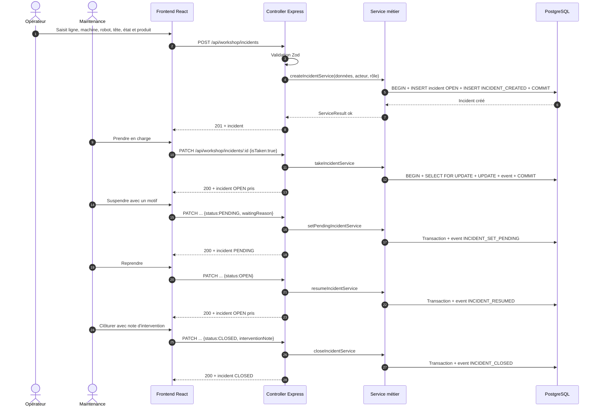
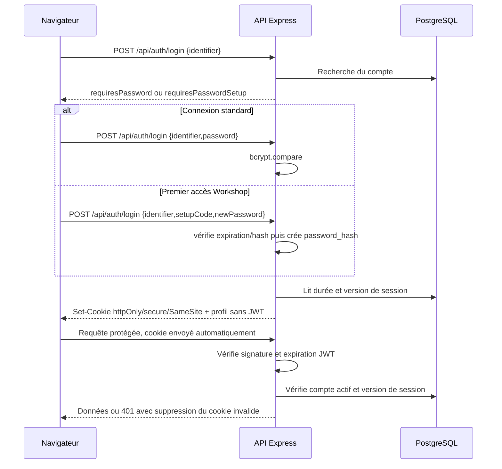

# Corrections finales prêtes à intégrer au dossier DWWM

> État du dépôt vérifié le 28 juillet 2026 sur le candidat RC4. Ce document ne remplace pas le dossier : il regroupe
> les textes corrigés à copier dans le DOCX. Les formulations ci-dessous séparent volontairement
> les faits démontrés par le dépôt, les résultats datés et les éléments personnels que seul l'auteur
> peut confirmer. Ne supprimer ces réserves qu'après avoir produit la preuve correspondante.

## 0. Couverture et chiffres de synthèse

### Bloc de couverture proposé

**SENTINEL**
Système de traçabilité et de pilotage des incidents de production industrielle

**Dossier de projet — Titre professionnel Développeur Web et Web Mobile**
Auteur : Mohamed Amine AKIK
Centre de formation : Studi
Application : `https://sentinel.akiksystems.fr`
Date de dépôt : conserver `09/07/2026` uniquement si cette date reste la date réelle de remise.

**Repères techniques vérifiables dans le dépôt**

- 14 tables applicatives PostgreSQL, auxquelles s'ajoute la table technique
  `schema_migrations` ;
- 50 migrations SQL numérotées ;
- 1 297 tests disjoints réellement verts : 511 tests unitaires backend, 146 tests
  d'intégration PostgreSQL, 583 tests frontend et 57 scénarios Chromium ;
- 18 fichiers de scénarios Playwright ;
- 6 jobs GitHub Actions : qualité backend, qualité frontend, intégration
  PostgreSQL, parcours navigateur, contrat des conteneurs et exercice
  sauvegarde/restauration.

Les seuils de couverture Jest (`backend/jest.config.ts`, `coverageThreshold`) portent sur un
périmètre configuré explicitement via `collectCoverageFrom` — utilitaires, domaine et services
métier jugés critiques — pas sur l'ensemble du code backend. Toute mention d'un pourcentage de
couverture dans le dossier doit préciser « sur le périmètre critique configuré », jamais présenter
le chiffre comme une couverture globale de l'application.

Ne plus afficher « 562 tests », « 579 tests », « 250 backend », « 312 frontend »,
« 38 migrations », « 2 E2E » ou « 4 jobs CI » : ces chiffres ne correspondent
plus au checkout audité. Le 28 juillet 2026, les quatre familles ont été
exécutées localement avec succès, PostgreSQL et Chromium compris. Une capture
de la CI distante verte sur le SHA finalement poussé reste nécessaire avant
d'attribuer ces six jobs à la version publiée.

**Sources** : `backend/migrations/`, `backend/jest.config.ts`,
`backend/src/integration/__tests__/`, `frontend/src/**/__tests__/`,
`frontend/e2e/`, `.github/workflows/ci.yml`,
`scripts/collectDossierFacts.py`.

---

## 1. Matrice complète des huit compétences

Le tableau actuel n'en contient que six. Le remplacer par celui-ci ; la colonne « Page » doit être
mise à jour automatiquement dans Word après la mise en page finale.

| Compétence du titre DWWM | Démonstration dans le dossier | Preuves principales dans le dépôt | Page finale |
|---|---|---|---|
| Installer et configurer son environnement de travail en fonction du projet web ou web mobile | §3.3, §4 et §14 : deux workspaces Node, variables d'environnement, Docker Compose, environnement local et production | `backend/package.json`, `frontend/package.json`, `docker-compose.yml`, `.env.release.example`, `README.md` | À reporter |
| Maquetter des interfaces utilisateur web ou web mobile | §5 : maquettes desktop/mobile, rôles, doctrine UX et enchaînement des écrans | `docs/doctrine-ux.md`, `docs/plan-ux.md`, `docs/dossier-projet/liste-captures-a-realiser.md` | À reporter |
| Réaliser des interfaces utilisateur statiques web ou web mobile | §8.1 : composants React réutilisables, HTML sémantique, SVG et CSS responsive à base de tokens | `frontend/src/components/`, `frontend/src/styles/base.css`, `frontend/src/styles/responsive.css` | À reporter |
| Développer la partie dynamique des interfaces utilisateur web ou web mobile | §8.2 : état React, appels API, filtres, synchronisation URL, permissions et concurrence réseau | `frontend/src/hooks/useIncidentPermissions.ts`, `frontend/src/hooks/useHistoryData.ts`, `frontend/src/hooks/useDebouncedValue.ts` | À reporter |
| Mettre en place une base de données relationnelle | §6 : MCD, MPD, contraintes, index et migrations PostgreSQL | `backend/migrations/`, `backend/src/db/migrate.ts` | À reporter |
| Développer des composants d'accès aux données SQL et NoSQL | §6.3 et §9.3 : SQL paramétré, transactions et usages documentaires de JSONB dans PostgreSQL | `backend/src/modules/workshop/workshop.repository.ts`, `backend/src/modules/workshop/workshop.repository.analytics.ts`, migrations 003, 004, 009, 012, 014 et 037 | À reporter |
| Développer des composants métier côté serveur | §9 : politiques, services transactionnels, validation Zod, audit et résultats typés | `backend/src/modules/workshop/workshop.policy.ts`, `workshop.service.edit.ts`, `workshop.service.mutations.ts`, `workshop.validation.ts` | À reporter |
| Documenter le déploiement d'une application dynamique web ou web mobile | §14 : architecture VPS, configuration, migration, sauvegarde, restauration et retour arrière | `docs/deploiement-vps.md`, `docs/runbook.md`, `docs/release-checklist.md`, `scripts/backup.sh`, `scripts/restore.sh` | À reporter |

Précision à conserver à l'oral : Sentinel n'utilise pas une base NoSQL distincte. La partie
documentaire est assurée par six colonnes JSONB PostgreSQL. Il faut la présenter comme un usage
NoSQL/documentaire local dans une base relationnelle, pas comme une expérience MongoDB.

---

## 3. Gestion de projet : planning et risques

### 3.2 — Planning réel

Le développement versionné couvre la période du 7 mai au 13 juillet 2026. L'historique Git permet
de reconstituer les jalons suivants sans inventer un volume horaire qui n'est pas tracé :

| Période | Jalon démontré | Preuve |
|---|---|---|
| 7 au 17 mai 2026 | Socle Express/React/PostgreSQL, intégrité de la base, authentification par JWT en cookie, premiers tests, CI et suivi d'incidents | commits `b440bd9`, `bf720c7`, `64c3dcf`, `d264c34`, `0dfcd1f` |
| 6 au 11 juin 2026 | Premier accès atelier, durcissement bcrypt, harmonisation UI, Caddy, sauvegarde/restauration, refactor du service Workshop, pseudonymisation RGPD et jeu d'essai API | commits `67deb04`, `e955632`, `1e2b061`, `0e6ee53`, `080d83f`, `e4b2548` |
| 15 au 25 juin 2026 | Qualité, accessibilité, décomposition des pages, publication GitHub, documentation VPS, doctrine UX, audit de production, sécurité et tests d'intégration | commits `547b2d4` à `296fffe` |
| 29 juin au 5 juillet 2026 | Audit d'administration, paramètres, révocation de sessions, cohérence d'authentification et durcissement du déploiement | historique Git des commits `1688c88` à `dd17b81` |
| 6 au 8 juillet 2026 | Refonte du dashboard et du dossier incident, séparation Historique/Journal, hooks de données, debounce et annulation réseau, transactions et uniformisation `ServiceResult` | commits `13679f2` à `6cbcbe8` |
| 10 au 13 juillet 2026 | Accès public à la page Confidentialité, durcissement des e-mails professionnels et correction du garde-fou CI | commits `575c5a1`, `dc7133e`, `9e8105b` |

Le projet a été conduit seul, par incréments courts. Les comportements sensibles ont été séparés en
commits ciblés puis vérifiés par lint, compilation et tests. Le volume d'heures hebdomadaire n'étant
pas enregistré dans le dépôt, il n'est pas chiffré ici. Si l'auteur possède un suivi personnel, il
peut ajouter son volume réel, sans le reconstituer a posteriori.

### 3.3 — Registre synthétique des risques

| Risque | Effet possible | Réponse mise en place | Risque résiduel honnête |
|---|---|---|---|
| Dérive du périmètre industriel | Retard et intégrations fragiles | MVP limité au signalement humain ; pilotage machine, MES, ERP et GMAO exclus | L'intégration machine reste une évolution à étudier équipement par équipement |
| Divergence entre règles frontend et backend | Bouton incohérent ou réponse 403 inattendue | Politique serveur explicite et miroir frontend testé | Les deux fichiers restent maintenus manuellement ; le serveur demeure l'autorité |
| Écritures concurrentes sur un incident | Perte de mise à jour ou audit incohérent | Transactions et `SELECT ... FOR UPDATE` pour les mutations sensibles | La preuve dépend des chemins appelant bien le repository avec le client transactionnel |
| Donnée incohérente ou doublon actif | Historique inexploitable | contraintes `CHECK`, clés étrangères et index unique partiel | Les structures JSONB restent principalement validées par l'application |
| Réponse réseau ancienne après une nouvelle recherche | Résultats sans rapport avec le filtre visible | debounce de 250 ms et `AbortController` | L'annulation intervient au changement de valeur débouncée ou de filtre, pas à chaque frappe brute |
| Secret ou origine de démonstration en production | Compromission de session | `assertProductionConfig`, cookies sécurisés et variables de release | `TRUST_PROXY` absent ne bloque pas le démarrage : il produit un avertissement |
| Conflit de ports sur le VPS existant | Indisponibilité d'un autre service | override de production, Caddy désactivé, ports backend/frontend liés à `127.0.0.1` | L'override doit être maintenu hors du fichier Compose générique |
| Perte de la base | Perte d'incidents et d'audit | volume PostgreSQL, scripts `backup.sh` et `restore.sh`, exercice jetable `11/11` avec RTO local de 5 s | La copie hors site, la restauration périodique et le RTO du VPS restent à vérifier en exploitation |
| Advisories React Router 6 | Redirection ambiguë ou vulnérabilité SSR non applicable au mode SPA | Audit production au seuil high, liens internes contrôlés, aucune hydratation SSR | Deux advisories modérées restent suivies dans l'issue `#29` ; la migration React Router 7 est hors RC4 |
| Conservation excessive de données personnelles | Non-conformité RGPD | suppression du compte opérationnel et pseudonymisation | aucune purge automatique des snapshots et journaux n'est implémentée |

**Sources** : historique Git, `INCIDENT_LIFECYCLE.md`, `backend/migrations/017_enforce_taken_consistency.sql`,
`backend/src/db/transaction.ts`, `frontend/src/hooks/useHistoryData.ts`,
`backend/src/config/production.ts`, `docs/audit-prod-resultats.md`.

---

## 4 et 14. Architecture et déploiement

### 4.1 — Architecture logique

Sentinel est une SPA React 18/TypeScript construite par Vite. Le navigateur appelle une API
Express/TypeScript en JSON. Le backend valide les entrées, applique les règles métier et accède à
PostgreSQL 15 par des requêtes paramétrées. Les sessions admin, Workshop et Board utilisent des JWT
distincts transportés dans des cookies `httpOnly`. Le dépôt est organisé en deux workspaces
indépendants, `frontend/` et `backend/` ; il ne contient pas de `package.json` racine déclarant des
workspaces npm.

### 4.4 — Deux modes d'exposition à ne pas confondre

Le `docker-compose.yml` fournit un mode autonome à quatre services : PostgreSQL, backend, frontend
Nginx et Caddy. Dans ce mode générique, seul Caddy publie les ports 80/443 ; les trois autres
services restent sur le réseau Docker `internal`.

Le VPS documenté utilise une topologie différente parce qu'un Nginx existe déjà sur l'hôte. Un
`docker-compose.override.yml` de production désactive Caddy, publie le backend uniquement sur
`127.0.0.1:3001` et le frontend uniquement sur `127.0.0.1:8080`, puis Nginx termine HTTPS et route
`/api/*` vers le backend et le reste vers le frontend. PostgreSQL n'est jamais publié sur l'hôte.
Il ne faut donc pas écrire que Caddy assure le TLS de la production actuellement documentée.

### 14 — Déploiement et exploitation

Le dépôt met en œuvre une **intégration continue**, pas un déploiement continu
automatique. Le workflow GitHub Actions exécute six jobs : qualité backend,
qualité frontend, intégration PostgreSQL, parcours Chromium, contrat des
conteneurs et exercice sauvegarde/restauration. Aucun job ne se connecte au VPS
ni ne déploie la branche `main`.

Le déploiement VPS décrit dans `docs/deploiement-vps.md` est manuel : récupération du dépôt,
création du `.env`, application de l'override, construction des images puis `docker compose up -d`.
Au démarrage, le backend exécute les migrations non encore enregistrées dans `schema_migrations`,
puis initialise le compte administrateur si nécessaire. Les healthchecks ordonnent le démarrage
PostgreSQL → backend → frontend.

La persistance repose sur le volume `sentinel_data`. Les scripts `scripts/backup.sh` et
`scripts/restore.sh` fournissent respectivement un `pg_dump` compressé avec rétention et une
restauration contrôlée. Le runbook documente sauvegarde avant mise à jour, contrôle `/api/health`,
retour au commit précédent et restauration si nécessaire. Le 28 juillet 2026,
l'exercice sur un projet PostgreSQL jetable a réussi `11/11` avec un RTO local
mesuré à 5 s. Cette preuve locale ne remplace ni une copie hors site ni une
restauration autorisée sur l'infrastructure cible.

**Sources** : `docker-compose.yml`, `Caddyfile`, `frontend/nginx.conf`,
`docs/deploiement-vps.md`, `.github/workflows/ci.yml`, `backend/src/server.ts`,
`backend/src/db/migrate.ts`, `docs/runbook.md`, `scripts/backup.sh`, `scripts/restore.sh`.

---

## 5.3 — Schéma d'enchaînement des maquettes

### Texte d'introduction

Les trois parcours partent du portail `/login`, mais n'utilisent pas la même session. Admin et
Workshop reposent sur des sessions utilisateur protégées par leurs gardes React et par les
middlewares backend. Board est une route publique côté React dont les données restent protégées
par une session Board dédiée ou par une session Workshop valide. La saisie du code Board crée donc
bien une session technique ; elle ne crée pas un compte utilisateur.

### Schéma à exporter en SVG depuis Mermaid

```mermaid
flowchart TB
  subgraph BOARD[Flux Board]
    B0["/login — portail"] -->|Bloc Board| B1["/board"]
    B1 --> B2{"GET /api/board/me"}
    B2 -->|Session Board ou Workshop valide| B4["Board grand écran — lecture seule"]
    B2 -->|Aucune session valide| B3["Saisie du code Board"]
    B3 -->|POST /api/board/session| B4
    B4 -->|Quitter : fermeture session Board| B0
    B4 -->|Si session Workshop détectée| B5["/workshop/dashboard"]
  end

  subgraph ADMIN[Flux Administration]
    A0["/login — portail"] -->|Bloc Administration| A1["/admin/login"]
    A1 --> A2["Identifiant puis mot de passe"]
    A2 -->|Cookie sentinel_admin_token| A3["/admin/accueil"]
    A3 --> A4["/admin/users"]
    A4 --> A5["/admin/users/:id"]
    A3 --> A6["/admin/lines"]
    A3 --> A7["/admin/audit"]
    A3 --> A8["/admin/support"]
    A3 --> A9["/admin/parametres"]
    A3 -->|Déconnexion| A0
  end

  subgraph WORKSHOP[Flux Workshop]
    W0["/login — portail"] -->|Bloc Workshop| W1["/workshop/login"]
    W1 --> W2["Saisie du badge"]
    W2 -->|Compte configuré| W3["Mot de passe"]
    W2 -->|Premier accès| W4["Code temporaire + nouveau mot de passe"]
    W3 -->|Cookie sentinel_workshop_token| W5["/workshop/dashboard"]
    W4 -->|Code valide, mot de passe créé et cookie| W5
    W5 --> W6["/workshop/pilotage"]
    W5 --> W7["/workshop/history"]
    W5 --> W8["/workshop/knowledge"]
    W5 --> W9["/workshop/support"]
    W5 --> W10["/workshop/journal — RESPONSABLE seulement"]
    W10 -->|Autre rôle| W5
    W5 -->|Déconnexion| W0
  end
```



**Légende prête à insérer** : *Figure 5.3 — Enchaînement des trois parcours Sentinel. Les routes
Admin sont protégées par `AdminRoute`, les routes Workshop par `WorkshopRoute`, et Journal ajoute
`WorkshopResponsableRoute`. Board reste en lecture seule mais ses données nécessitent une session
Board créée par code ou une session Workshop encore valide.*

**Sources** : `frontend/src/App.tsx`, `frontend/src/routes/AdminRoute.tsx`,
`frontend/src/routes/WorkshopRoute.tsx`, `frontend/src/routes/WorkshopResponsableRoute.tsx`,
`frontend/src/pages/BoardAccessPage.tsx`, `frontend/src/pages/WorkshopBoardPage.tsx`,
`backend/src/modules/board/board.auth.ts`.

---

## 6. Conception de la base de données

### 6.1 — Choix technique, formulation corrigée

Sentinel utilise PostgreSQL 15 et le pilote `pg`, sans ORM. Le domaine est principalement
relationnel : utilisateurs, lignes, incidents, acteurs, événements et suivis sont reliés par des
clés étrangères. Les requêtes analytiques du module Pilotage utilisent des agrégats, des CTE et
`percentile_cont`, ce qui justifie ici un SQL explicite. Les valeurs provenant des utilisateurs
sont transmises comme paramètres (`$1`, `$2`, etc.) ; cette pratique neutralise l'injection dans
les valeurs. Elle ne dispense pas de mettre sur liste blanche les fragments SQL qui ne peuvent pas
être paramétrés, par exemple un ordre de tri ou un nom de colonne.

### 6.2 — MCD corrigé : quatorze tables applicatives

Le schéma précédent oubliait plusieurs tables ajoutées par le durcissement :
`password_reset_requests`, `admin_system_audit_events`,
`workshop_arbitration_cases`, `production_line_machines` et
`notification_outbox`. Utiliser le diagramme suivant :

```mermaid
erDiagram
  ADMIN_ACCOUNTS ||--o{ ACCOUNT_AUDIT_EVENTS : "effectue"
  ADMIN_ACCOUNTS ||--o{ LINE_AUDIT_EVENTS : "effectue"
  ADMIN_ACCOUNTS ||--o{ ADMIN_SYSTEM_AUDIT_EVENTS : "effectue"

  SENTINEL_USERS ||--o{ PASSWORD_RESET_REQUESTS : "demande"
  SENTINEL_USERS ||--o{ ACCOUNT_AUDIT_EVENTS : "est cible de"
  SENTINEL_USERS ||--o{ WORKSHOP_INCIDENTS : "declare"
  SENTINEL_USERS ||--o{ WORKSHOP_INCIDENTS : "prend en charge"
  SENTINEL_USERS ||--o{ WORKSHOP_INCIDENT_EVENTS : "agit"
  SENTINEL_USERS ||--o{ WORKSHOP_INCIDENT_FOLLOWERS : "suit"
  SENTINEL_USERS ||--o{ WORKSHOP_ARBITRATION_CONSULTATIONS : "consulte"
  SENTINEL_USERS ||--o{ WORKSHOP_ARBITRATION_CASES : "demande ou décide"

  PRODUCTION_LINES ||--o{ WORKSHOP_INCIDENTS : "concerne"
  PRODUCTION_LINES ||--o{ LINE_AUDIT_EVENTS : "est cible de"
  PRODUCTION_LINES ||--o{ PRODUCTION_LINE_MACHINES : "normalise"

  WORKSHOP_INCIDENTS ||--o{ WORKSHOP_INCIDENT_EVENTS : "produit"
  WORKSHOP_INCIDENTS ||--o{ WORKSHOP_INCIDENT_FOLLOWERS : "est suivi par"
  WORKSHOP_INCIDENTS ||--o{ WORKSHOP_ARBITRATION_CONSULTATIONS : "porte"
  WORKSHOP_INCIDENTS ||--o{ WORKSHOP_ARBITRATION_CASES : "porte"
  WORKSHOP_INCIDENT_EVENTS ||--o| WORKSHOP_ARBITRATION_CONSULTATIONS : "demande consultee"
  WORKSHOP_INCIDENT_EVENTS ||--o| WORKSHOP_ARBITRATION_CASES : "ouvre"
  WORKSHOP_INCIDENT_EVENTS ||--o| NOTIFICATION_OUTBOX : "notifie"
  PASSWORD_RESET_REQUESTS ||--o| NOTIFICATION_OUTBOX : "notifie"

  ADMIN_ACCOUNTS {
    int id PK
    varchar username UK
    varchar password_hash
    varchar email
  }
  SENTINEL_USERS {
    int id PK
    varchar badge_number
    varchar role
    varchar email
    boolean is_active
    boolean is_deleted
  }
  PRODUCTION_LINES {
    int id PK
    varchar line_number
    jsonb machine_sequence
    boolean is_active
    boolean is_deleted
  }
  PRODUCTION_LINE_MACHINES {
    int line_id PK_FK
    int position PK
    varchar machine_id
    jsonb payload
  }
  WORKSHOP_INCIDENTS {
    int id PK
    int user_id FK
    int line_id FK
    int taken_by_user_id FK
    varchar status
    varchar state
    jsonb edit_request
  }
  WORKSHOP_INCIDENT_EVENTS {
    int id PK
    int incident_id FK
    int actor_user_id FK
    varchar event_type
    jsonb payload
  }
  WORKSHOP_INCIDENT_FOLLOWERS {
    int id PK
    int incident_id FK
    int user_id FK
    timestamptz deleted_at
  }
  WORKSHOP_ARBITRATION_CONSULTATIONS {
    int request_event_id PK_FK
    int incident_id FK
    int consulted_by_user_id FK
    varchar request_type
  }
  WORKSHOP_ARBITRATION_CASES {
    bigint id PK
    int incident_id FK
    int request_event_id FK
    varchar request_type
    varchar status
    jsonb payload
    text reason
  }
  ACCOUNT_AUDIT_EVENTS {
    int id PK
    int target_user_id FK
    int admin_id FK
    jsonb changes
  }
  LINE_AUDIT_EVENTS {
    int id PK
    int target_line_id FK
    int admin_id FK
    jsonb changes
  }
  ADMIN_SYSTEM_AUDIT_EVENTS {
    int id PK
    int admin_id FK
    varchar event_type
    jsonb changes
  }
  PASSWORD_RESET_REQUESTS {
    int id PK
    int user_id FK
    varchar badge_number
    timestamptz requested_at
    timestamptz handled_at
  }
  NOTIFICATION_OUTBOX {
    bigint id PK
    int source_event_id FK
    int password_reset_request_id FK
    varchar status
    int attempt_count
  }
```

**Légende** : *Figure 6.1 — MCD/MLD synthétique des quatorze tables applicatives. Les relations
principales suivent les clés étrangères réelles des migrations. La table technique
`schema_migrations`, créée par le moteur de migration, est volontairement hors du domaine métier.*

### 6.3 — JSONB, formulation complète

Sentinel possède six colonnes JSONB, regroupées en trois usages :

1. `production_lines.machine_sequence` stocke l'agrégat de configuration d'une ligne : ordre des
   machines, robot simple ou double et nombre de têtes. Cette structure est lue et remplacée comme
   un tout ; l'application la valide avant écriture. Une modélisation entièrement normalisée en
   tables `machines`, `robots` et `heads` aurait aussi été possible. Le compromis JSONB réduit le
   nombre de jointures et simplifie la réorganisation, au prix de contraintes référentielles moins
   fortes à l'intérieur du document.
2. `workshop_incidents.edit_request` conserve une proposition de correction structurée avant son
   approbation. Une contrainte `chk_edit_request_shape` impose un objet contenant au moins un champ
   métier connu.
3. `workshop_incident_events.payload`, `account_audit_events.changes`,
   `line_audit_events.changes` et `admin_system_audit_events.changes` portent des détails variables
   selon le type d'événement. Les colonnes relationnelles conservent l'identité, la cible, le type
   et l'horodatage ; JSONB ne contient que le contexte hétérogène.

Il ne faut donc plus écrire « deux usages de JSONB » ni laisser entendre que le reste des tables ne
contient aucun document. JSONB est un choix local dans PostgreSQL, pas une seconde base de données.

### 6.4 — MPD et dictionnaire

Le MPD doit présenter les quatorze tables applicatives ci-dessus, leurs types PostgreSQL, PK, FK,
contraintes et index, puis signaler séparément `schema_migrations(filename, applied_at)`. Pour
`workshop_incidents`, faire apparaître au minimum :

- les statuts `OPEN`, `PENDING`, `CLOSED`, `CANCELED`, `INVALIDATED` ;
- les états `SKIPEE_PAR_MACHINE`, `SKIPEE_PAR_CONDUCTEUR`, `DEGRADEE`, `INDISPONIBLE` ;
- `chk_taken_consistency` et `chk_pending_must_be_taken` ;
- l'index unique partiel `idx_unique_active_incident_per_machine` sur
  `(line_id, machine_id, robot_label, head_number)` pour les statuts actifs ;
- les snapshots d'identité ajoutés par les migrations 025 à 028.

### 6.5 — Migrations

Le schéma est produit par 50 fichiers SQL numérotés dans `backend/migrations/`. Le moteur
`backend/src/db/migrate.ts` crée `schema_migrations`, calcule les fichiers non encore appliqués,
exécute chaque migration dans une transaction puis enregistre son nom. Les migrations sont
idempotentes au niveau du moteur parce qu'un fichier déjà enregistré n'est pas rejoué ; cela ne
signifie pas que chaque instruction SQL serait réversible. La procédure de retour arrière repose
sur une sauvegarde et une restauration, pas sur des fichiers `down` absents du projet.

**Sources** : `backend/migrations/001_create_admin_accounts.sql` à
`050_enforce_single_active_arbitration_heads.sql`, `backend/src/db/migrate.ts`,
`backend/src/modules/workshop/workshop.repository.analytics.ts`.

---

## 7. Diagrammes UML : textes et légendes exacts

### 7.1 — Cas d'utilisation

**Texte** : le diagramme distingue quatre acteurs. L'Opérateur déclare un incident et peut demander
la correction ou l'annulation de sa propre déclaration. La Maintenance prend, suspend, reprend et
clôture les incidents selon leur état. Le Responsable arbitre les demandes, définit la priorité,
ajoute une consigne, suit un incident et accède au Journal. L'Administrateur gère les comptes, les
lignes, les paramètres et les journaux de référentiel. Board est une consultation collective en
lecture seule, protégée par une session dédiée.

**Légende** : *Figure 7.1 — Cas d'utilisation Sentinel par rôle. Le diagramme représente les
capacités métier ; les règles détaillées selon le statut de l'incident sont portées par la matrice
`workshop.policy.ts`.*

### 7.2 — Séquence corrigée du cycle complet

Le diagramme précédent sautait la reprise et tentait de clôturer directement un incident
`PENDING`, transition interdite. Utiliser cette version :



**Légende** : *Figure 7.2 — Séquence nominale du cycle d'un incident. Chaque mutation est validée,
autorisée puis écrite avec son événement d'audit. Un incident suspendu doit repasser par `RESUME`
avant `CLOSE`.*

### 7.3 — États

**Légende** : *Figure 7.3 — Automate d'état d'un incident. `OPEN` possède deux situations métier,
non pris et pris. `PENDING` exige une prise en charge et un motif de mise en attente ;
`diagnostic` reste réservé au vrai diagnostic de maintenance et `CLOSED` exige une note
d'intervention ; `CANCELED` et `INVALIDATED` restent conservés dans l'historique.*

**Sources** : `INCIDENT_LIFECYCLE.md`, `backend/src/domain/constants.ts`,
`backend/src/modules/workshop/workshop.policy.ts`,
`backend/src/modules/workshop/workshop.service.mutations.ts`.

---

## 8. Réalisations front-end : formulations exactes

### 8.1 — Interfaces statiques

Le frontend associe des primitives de présentation réutilisables (`StarIcon`, les composants de
`IncidentBadges`, `KpiCard`, `CharCounter`) et des composants de composition (`IncidentCard`,
`IncidentDetailPanel`, `Modal`). Ils portent le balisage, les attributs d'accessibilité, la mise en
page et les variantes visuelles. Les chargements, mutations et principales règles de permission
sont déplacés vers les pages, hooks et utilitaires présentés au §8.2. Il ne faut toutefois pas les
qualifier tous de « composants purs sans logique » : `IncidentCard` dérive un niveau d'attention et
gère clavier/clic, tandis que `Modal`, `SelectField` et `ResponsiveNavBar` possèdent un état
d'interaction local.

`StarIcon` est un SVG 16 × 16 utilisant `currentColor`. Sa prop `filled` change uniquement son
apparence. Il est réutilisé dans `IncidentCard` et `IncidentDetailPanel`; la décision de suivre un
incident et l'appel API correspondant relèvent de l'interface dynamique.

La grammaire d'attention ne repose pas sur quatre variables nues. Elle utilise douze tokens :
`--attention-{calm|watch|act|critical}-{bg|border|text}`. Ils sont déclarés dans
`frontend/src/styles/base.css` et employés par les styles Workshop, Board et Pilotage.

**Légende desktop suggérée** : *Figure 8.1 — Tableau de bord Responsable à 1440 × 900. Les cartes,
badges et niveaux d'attention partagent les mêmes composants et tokens ; l'incident suivi rend
visible le même `StarIcon` que dans son dossier.*

**Légende mobile suggérée** : *Figure 8.2 — Dossier incident à 390 × 844. Sous 700 px, la liste est
masquée quand le détail est ouvert et le panneau occupe toute la largeur de la zone de résultats.*

### 8.2 — Interfaces dynamiques

`useIncidentPermissions` dérive treize permissions directes du dossier incident. Deux capacités
d'arbitrage supplémentaires combinent les actions d'approbation et de rejet des demandes de
correction ou d'annulation. Il est donc plus exact d'écrire « treize permissions directes,
complétées par deux capacités d'arbitrage » que « treize vérifications au total ». Le composant
`IncidentDetailPanel` transforme ces booléens en groupes d'actions visibles. Cette logique
d'affichage ne constitue pas une protection : chaque mutation est contrôlée côté serveur.

`useHistoryData` centralise la recherche, quatre filtres, leur synchronisation avec l'URL, la liste
d'incidents, la sélection et le chargement de la trace. La saisie utilise la valeur par défaut de
250 ms de `useDebouncedValue`. L'effet crée un `AbortController`, transmet son signal à la requête
et appelle `abort()` lors du nettoyage. La formulation précise est : « une requête antérieure est
annulée lorsque la valeur débouncée ou un filtre change », et non « dès chaque nouvelle frappe ».

**Légende permissions** : *Figure 8.3 — Même incident `OPEN`, non pris et non prioritaire sous les
trois rôles. L'Opérateur propriétaire voit “Demander une correction”, la Maintenance voit “Prendre
en charge” et “Modifier”, le Responsable voit “Déclarer urgent” et “Modifier”.*

**Légende filtres** : *Figure 8.4 — Historique filtré par recherche, statut, ligne et machine. Les
chips, le compteur, la liste, le dossier sélectionné et les paramètres d'URL sont recalculés à
partir du même état.*

**Sources** : `frontend/src/components/icons/StarIcon.tsx`,
`frontend/src/components/IncidentCard.tsx`, `frontend/src/components/IncidentDetailPanel.tsx`,
`frontend/src/components/IncidentBadges.tsx`, `frontend/src/styles/base.css`,
`frontend/src/hooks/useIncidentPermissions.ts`, `frontend/src/hooks/useHistoryData.ts`,
`frontend/src/hooks/useDebouncedValue.ts`.

---

## 9. Réalisations back-end : formulations exactes

### 9.1 — Autorisations

`backend/src/modules/workshop/workshop.policy.ts` est la source de vérité des actions du cycle de
vie déclarées dans `INCIDENT_ACTIONS` : correction, annulation, prise en charge, attente, reprise,
clôture, priorité, consigne et invalidation. Il ne faut pas le présenter comme l'unique décisionnaire
de toute l'application : les middlewares d'authentification, les routes Admin/Workshop, le service
Journal et certaines capacités spécifiques comme suivre un incident possèdent aussi des contrôles
dédiés. Le fichier frontend `utils/workshopPermissions.ts` en est un miroir d'expérience ; il peut
masquer un bouton, mais seule la vérification serveur autorise l'écriture.

### 9.2 — Service transactionnel

Les écritures du domaine Workshop sont réparties entre `workshop.service.edit.ts` et
`workshop.service.mutations.ts`. `followIncidentService` illustre une transaction atomique : contrôle
du rôle, `BEGIN`, lecture de l'incident avec verrou, contrôle de son état, écriture du suivi,
insertion de l'événement puis `COMMIT`. En cas d'exception, `withTransaction` exécute `ROLLBACK`.
Le `FOR UPDATE` de `getIncidentById` protège la ligne uniquement lorsqu'un `PoolClient`
transactionnel lui est transmis ; hors transaction explicite, le verrou serait libéré à la fin de
la requête.

### 9.3 — Accès aux données

L'accès SQL du domaine Workshop est concentré dans `workshop.repository.ts`,
`workshop.repository.analytics.ts` et le helper de persistance `workshop.events.ts`. Il est donc
inexact d'affirmer que le repository est le seul fichier de toute l'application qui parle SQL.
Les valeurs sont paramétrées ; les fragments dynamiques sont construits à partir de valeurs
validées. Les requêtes analytiques utilisent notamment des CTE et `percentile_cont`.

### 9.4 — Validation

Les controllers valident leurs entrées avec Zod avant d'appeler le service. Les limites backend de
`backend/src/domain/constants.ts` sont exposées par `/api/config`. Le frontend possède néanmoins
aussi un miroir statique dans `frontend/src/utils/fieldLimits.ts`, et plusieurs composants
l'importent directement. Il faut donc écrire « constantes backend exposées au frontend avec
fallback statique aligné », pas « source unique sans duplication ».

### 9.5 — Résultats métier typés

Les services publics du module Workshop retournent un `ServiceResult<T>` discriminé entre succès
et erreur métier (`status`, `code`, `message`). Les controllers utilisent `sendServiceError` avant
d'émettre la réponse. Restreindre cette affirmation au module Workshop : d'autres modules du dépôt
conservent encore quelques fonctions de lecture retournant directement un DTO ou un tableau.

**Sources** : `backend/src/modules/workshop/workshop.policy.ts`,
`backend/src/modules/workshop/workshop.service.ts`, `workshop.service.edit.ts`,
`workshop.service.mutations.ts`, `workshop.repository.ts`, `workshop.repository.analytics.ts`,
`workshop.events.ts`, `backend/src/db/transaction.ts`, `backend/src/utils/serviceResult.ts`.

---

## 10. Sécurité, JWT et veille

### 10.1 — Authentification et sessions

Sentinel utilise trois cookies distincts : `sentinel_admin_token`, `sentinel_workshop_token` et
`sentinel_board_token`. Ils contiennent un JWT signé avec `JWT_SECRET`; le token n'est jamais renvoyé
dans le JSON de connexion. En production, les cookies sont `httpOnly`, `secure` et
`SameSite=Strict`. `httpOnly` réduit le risque d'exfiltration directe du token par JavaScript ; il
ne rend pas une éventuelle XSS sans effet, car un script injecté pourrait encore provoquer des
requêtes avec le cookie.

Les sessions Admin et Workshop sont configurables de 1 à 168 heures, avec une valeur par défaut de
8 heures. Le Board a une valeur par défaut de 12 heures et peut être configuré de 0 à 168 heures ;
0 signifie une session sans expiration JWT, révocable par le compteur `board_session_version`.
Les JWT nouvellement émis incluent une version de session. Le middleware Workshop vérifie en base
l'identifiant, le badge, l'activation, la non-suppression, la présence d'un mot de passe et la
version de session. Le middleware Admin compare la version courante du compte. Une désactivation,
une réinitialisation ou une révocation incrémente la version. Une suppression invalide la session
par `is_deleted`, retire les credentials et fait échouer la vérification en base.

Les mots de passe sont hachés avec bcrypt : coût 10 pour Workshop et 12 pour Admin. Le premier
accès Workshop utilise un code aléatoire de 10 caractères dans un alphabet sans caractères
ambigus. Le code est normalisé puis haché par bcrypt ; son expiration est configurable et vaut
24 heures par défaut. Le mot de passe Workshop contient au moins 6 caractères, celui d'Admin au
moins 12, et les deux sont bornés à 128 caractères.

Le limiteur de connexion compte les échecs par IP et identité sur une fenêtre de 5 minutes ; le
seuil applicatif vaut 10 par défaut et est configurable. Un limiteur global distinct vaut 3 000
requêtes par IP et par 15 minutes par défaut, hors `/api/health`.

### 10.2 — OWASP Top 10 complet

| Risque | Mesure réellement présente |
|---|---|
| A01 — Contrôle d'accès défaillant | middlewares Admin/Workshop/Board, garde Responsable pour Journal, politique serveur et revalidation avant mutation |
| A02 — Défaillances cryptographiques | bcrypt, JWT signé, secrets de production d'au moins 24 caractères, cookies `secure` en production |
| A03 — Injection | validation Zod, paramètres SQL, listes blanches pour les variantes de requêtes |
| A04 — Conception non sécurisée | cycle d'état explicite, transactions, contraintes SQL et audit trail |
| A05 — Mauvaise configuration | `assertProductionConfig`, CORS à origine unique, CSP, `X-Frame-Options`, `nosniff`, HSTS en production |
| A06 — Composants vulnérables ou obsolètes | `npm audit --audit-level=high` dans les jobs backend/frontend et Dependabot hebdomadaire |
| A07 — Identification et authentification | rate limiting, messages génériques, versions de session révocables et code temporaire expirant |
| A08 — Intégrité logicielle et des données | lockfiles utilisés par `npm ci`, migrations versionnées, contraintes et événements écrits en mode append-only par les services |
| A09 — Journalisation et surveillance | Pino, redaction des cookies/Authorization, healthcheck DB et journaux métier/admin horodatés |
| A10 — SSRF | aucune URL fournie par l'utilisateur n'est appelée côté serveur ; l'unique appel HTTP sortant applicatif utilise une constante vers l'API DeepSeek |

### 10.3 — Flux JWT corrigé



**Légende** : *Figure 10.1 — Authentification unifiée et contrôle d'une session. La signature du JWT
ne suffit pas : l'état et la version du compte sont relus en base pour permettre une révocation
avant l'expiration.*

### 10.4 — Veille sécurité fondée sur des preuves du dépôt

> Dans ce projet, ma veille vérifiable repose d'abord sur des contrôles automatisés. Dependabot
> surveille chaque lundi les dépendances npm du backend et du frontend. Sur les pushes vers `main`
> ou `refactor/**` et les pull requests vers `main`, GitHub Actions exécute
> `npm audit --audit-level=high` après une installation reproductible
> par `npm ci`. Je complète ces alertes par des audits ciblés du code : suppression d'une fuite
> d'énumération à la connexion (`e998463`), ajout du rate limiting global (`296fffe`) et durcissement
> du traitement des e-mails professionnels (`dc7133e`). Une alerte n'est pas corrigée en mettant à
> jour aveuglément : je vérifie le chemin affecté, j'exécute lint/build/tests et je contrôle la CI
> avant intégration. Le dépôt prouve cette pratique automatisée ; je ne revendique pas ici une
> consultation régulière de CERT-FR, de l'ANSSI ou d'une newsletter que je ne peux pas documenter.

**Sources** : `backend/src/auth/`, `backend/src/middlewares/adminAuth.ts`,
`backend/src/middlewares/workshopAuth.ts`, `backend/src/modules/board/board.auth.ts`,
`backend/src/middlewares/loginRateLimit.ts`, `backend/src/middlewares/securityHeaders.ts`,
`backend/src/config/production.ts`, `.github/dependabot.yml`, `.github/workflows/ci.yml`.

---

## 11. RGPD — chapitre complet et honnête

### 11.1 — Données et finalités

Le responsable du traitement est l'entreprise ou l'établissement qui déploie Sentinel et décide
de son usage. Sentinel traite, pour les comptes Workshop, le prénom, le nom, le numéro de badge
professionnel, le rôle et éventuellement une adresse e-mail professionnelle. Pour le compte Admin,
il traite un nom d'utilisateur et éventuellement une adresse e-mail. Les demandes de
réinitialisation conservent l'identifiant utilisateur, le badge et les dates de demande/traitement.

Les incidents et journaux enregistrent aussi les données nécessaires à la traçabilité : déclarant,
technicien, acteur d'une action, rôle, horodatage, ligne, machine, diagnostic, note d'intervention,
consigne et motif d'arbitrage. Les logs HTTP peuvent contenir des métadonnées techniques telles que
l'adresse IP, la route, le statut et l'agent utilisateur ; les cookies et l'en-tête Authorization
sont expurgés par la configuration Pino. Aucune donnée biométrique, photo, géolocalisation ou donnée
publicitaire n'est collectée.

Les finalités sont la déclaration et le traitement des anomalies, la continuité de maintenance,
l'attribution des actions, le pilotage de production, la constitution d'une base de connaissance,
la sécurité de l'accès et l'administration du référentiel.

### 11.2 — Base légale et acteurs

Dans une entreprise privée, l'intérêt légitime de l'employeur peut constituer la base légale du
suivi de production et de la traçabilité professionnelle. Cette base n'est pas décidée par le code :
l'entreprise doit documenter la nécessité, la proportionnalité et la mise en balance avec les
droits des salariés. Selon le contexte, les obligations légales ou conventionnelles de traçabilité
peuvent aussi intervenir. L'administrateur Sentinel agit pour le compte du responsable de
traitement ; il n'en devient pas automatiquement le responsable.

### 11.3 — Minimisation, destinataires et sous-traitants

L'e-mail professionnel est facultatif et n'est pas un identifiant de connexion. Les notifications
ne ciblent que les personnes actives concernées par leur rôle, leur suivi ou leur intervention.
Les adresses ne sont pas copiées dans les événements d'audit ; seule l'action « configuré, modifié
ou retiré » y est enregistrée. Si SMTP est activé, le prestataire de messagerie reçoit les données
nécessaires à l'acheminement des notifications et doit être encadré par l'entreprise.

Le support IA est facultatif et désactivé sans `DEEPSEEK_API_KEY`. Lorsqu'il est activé, le message
saisi et les dix derniers messages d'historique sont envoyés par le backend à l'URL fixe de l'API
DeepSeek. Le
service n'injecte aucune donnée de production dans le prompt système, mais un utilisateur peut en
saisir lui-même. La notice actuelle `/confidentialite` ne décrit pas ce transfert. Avant un usage
réel, l'entreprise doit donc soit désactiver cette fonctionnalité, soit informer les utilisateurs,
interdire la saisie de données personnelles ou industrielles sensibles, vérifier les conditions de
sous-traitance et les éventuels transferts hors EEE. Ce point est une limite actuelle, pas une
conformité déjà acquise.

### 11.4 — Conservation, suppression et traçabilité

La désactivation bloque la connexion et incrémente la version de session sans effacer le compte.
La suppression logique remplace le prénom et le nom par des valeurs génériques, transforme le badge
en `ANON-<id>`, retire l'e-mail, le mot de passe et le code temporaire, et conserve l'identifiant
technique pour les clés étrangères. Il s'agit d'une pseudonymisation du compte opérationnel, pas
d'une anonymisation irréversible de tout le système.

Les migrations 025 à 028 figent le nom, le rôle et parfois le badge du déclarant, du technicien et
des acteurs dans les incidents et événements. Ces snapshots ne sont pas réécrits lors de la
suppression du compte. Ils préservent l'audit industriel mais peuvent rester des données
personnelles accessibles aux rôles habilités. Aucun délai automatique de purge n'est implémenté.
L'entreprise doit définir une durée par catégorie — comptes supprimés, incidents, audits, demandes
de reset, logs et sauvegardes — puis mettre en place purge ou anonymisation lorsque la conservation
n'est plus nécessaire.

### 11.5 — Droits et sécurité

Les demandes d'accès, rectification, effacement, limitation ou opposition sont adressées à
l'entreprise. L'Admin peut modifier, désactiver et supprimer le compte courant, mais l'application
ne fournit pas d'export RGPD autonome et la rectification ne réécrit pas les snapshots historiques.
La personne doit être informée du point de contact interne et de son droit de saisir la CNIL.

Les mesures techniques comprennent contrôle d'accès par rôle, cookies sécurisés, mots de passe
hachés, révocation par version de session, journalisation, redaction des secrets, SQL paramétré,
sauvegardes et page publique `/confidentialite`. Ces mesures doivent être complétées, en exploitation,
par une politique de conservation, une gestion des habilitations, une procédure de violation de
données et l'encadrement contractuel des prestataires SMTP et IA.

**Sources** : migrations 023 et 025 à 031, `backend/src/modules/accounts/accounts.repository.ts`,
`backend/src/modules/notifications/`, `backend/src/modules/support/support.service.ts`,
`backend/src/logger.ts`, `backend/src/server.ts`, `frontend/src/pages/PrivacyPage.tsx`.

---

## 12. Jeu d'essai

### Texte sûr à insérer

Le fichier `docs/jeu-essai.md` conserve une exécution réelle datée du 11 juin 2026 contre Express et
PostgreSQL. Elle comprend 18 cas : cycle complet, refus de permissions, approbation d'une correction,
validation des entrées et sécurité des accès. Les résultats bruts y sont conservés. Cette preuve est
une photographie datée ; le code a continué d'évoluer ensuite.

Le scénario métier nominal reste :

| Étape | Entrée fonctionnelle | Résultat attendu dans la version actuelle | Preuve |
|---|---|---|---|
| Connexion Opérateur | badge puis mot de passe | cookie Workshop et profil `OPERATOR` | `auth.integration.test.ts` |
| Création | ligne, machine, robot, tête, état, produit | HTTP 201, incident `OPEN`, non pris, événement `INCIDENT_CREATED` | controller + intégration |
| Prise en charge | Maintenance, `isTaken:true` | incident `OPEN` pris et `INCIDENT_TAKEN` | intégration |
| Suspension | motif + `status:PENDING` | incident `PENDING`, `waiting_reason` et `INCIDENT_SET_PENDING` | intégration |
| Reprise | `status:OPEN` | incident `OPEN` toujours pris et `INCIDENT_RESUMED` | intégration |
| Clôture | note + `status:CLOSED` | incident `CLOSED` et `INCIDENT_CLOSED` | intégration |
| Contrôle d'accès | Opérateur tente prise ou clôture | HTTP 403, aucune mutation | politique + intégration |

Trois corrections sont indispensables avant de reprendre les anciennes réponses mot pour mot :

- la création renvoie maintenant HTTP 201, pas 200 ;
- `FIELD_LIMITS.COMMENT` vaut maintenant 500 caractères, pas 1 000 ;
- le login est limité par défaut à 10 échecs sur 5 minutes, tandis que le limiteur global vaut
  3 000 requêtes sur 15 minutes. L'ancien constat « blocage à la 19e tentative » appartient à
  l'exécution du 11 juin et ne décrit plus la configuration par défaut actuelle.

Pour déclarer un jeu d'essai final sans réserve, réexécuter `docs/jeu-essai.md` sur la version
déposée, reporter les nouveaux identifiants/horodatages, puis joindre quatre captures : création,
incident pris, incident suspendu et incident clôturé avec sa trace. En l'absence de cette nouvelle
exécution, conserver explicitement la date du 11 juin et ne pas présenter les réponses historiques
comme celles du build final.

**Sources** : `docs/jeu-essai.md`, `backend/src/integration/__tests__/workshop.integration.test.ts`,
`backend/src/integration/__tests__/auth.integration.test.ts`,
`backend/src/modules/workshop/workshop.controller.ts`, `backend/src/domain/constants.ts`,
`backend/src/middlewares/loginRateLimit.ts`.

---

## 13. Tests

### 13.1 — Stratégie et chiffres actuels

Le backend utilise Jest avec deux projets. Le projet `unit` contient 511 tests
et emploie des mocks pour isoler services, policies, validations et
repositories. Le projet `integration` contient 146 tests répartis dans 21 suites,
exécutés contre PostgreSQL réel et jetable. Le frontend contient 583 tests
Vitest/Testing Library en `jsdom`. Les 18 fichiers Playwright portent 57
scénarios Chromium couvrant les espaces public, Admin, Atelier et Board,
l'accessibilité, le responsive, les mutations et les parcours métier. Ils sont
exécutés par le job CI `Browser / Critical journeys`.

Le 28 juillet 2026, les commandes suivantes ont été exécutées dans le checkout
audité :

- `cd backend && npm test` : 48 suites, 511 tests passants ;
- PostgreSQL jetable : 21 suites, 146 tests passants, nettoyage complet ;
- `cd frontend && npm test` : 58 fichiers, 583 tests passants ;
- Chromium sur PostgreSQL jetable : 57 scénarios passants.

Les six jobs CI reproduisent ces familles et ajoutent audits, builds, contrat
des images, préflight registry-only et restauration. Ajouter une capture GitHub
Actions du commit réellement poussé avant d'écrire « la CI distante est verte ».

### 13.2 — Choix de preuves

Présenter au maximum trois preuves lisibles :

1. un test de `workshop.policy.test.ts` montrant un refus selon rôle/statut ;
2. un test d'intégration du cycle `create → take → pending → resume → close` avec PostgreSQL ;
3. une capture de la CI verte donnant le SHA, la date et les six jobs.

**Sources** : `backend/jest.config.ts`, `backend/src/**/__tests__/`,
`backend/src/integration/__tests__/`, `frontend/src/**/__tests__/`,
`frontend/e2e/edit-machine.spec.ts`, `frontend/playwright.config.ts`, `.github/workflows/ci.yml`.

---

## 15. Bilan personnel proposé

> Ce passage est une proposition rédigée à partir du parcours visible dans Git. L'auteur doit le
> relire et ne conserver que ce qui correspond réellement à son expérience personnelle.

Sentinel m'a appris à transformer une observation de terrain en règles explicites, puis à faire
traverser ces règles dans toute une application : maquette, interface, API, service, base de données,
tests et exploitation. La partie la plus formatrice n'a pas été l'ajout d'écrans, mais le travail de
cohérence : rendre un cycle d'incident compréhensible pour trois rôles tout en garantissant côté
serveur qu'aucune transition interdite ne puisse être imposée par le client.

Les audits successifs m'ont aussi montré qu'un projet fonctionnel n'est pas encore un projet
fiable. J'ai dû corriger des fenêtres de concurrence, compléter l'audit trail, séparer Historique et
Journal, uniformiser les résultats de service, améliorer l'accessibilité et documenter le retour
arrière. Cette démarche m'a fait progresser dans la lecture critique de mon propre code : chercher
les hypothèses implicites, puis les transformer en contraintes, tests ou procédures vérifiables.

Si je recommençais, je formaliserais plus tôt le modèle de données, l'automate d'état et la matrice
de permissions. J'ajouterais dès le début des parcours end-to-end multi-rôles et une politique de
conservation RGPD, au lieu de les traiter principalement pendant le durcissement final. Je
distinguerais aussi dès la première version le Compose autonome et la topologie réelle du VPS pour
éviter toute ambiguïté de documentation.

Le projet reste volontairement limité : il ne pilote aucune machine, n'intègre pas encore de GMAO
et ne mesure pas une adoption industrielle réelle. La prochaine étape pertinente n'est pas
d'ajouter des fonctions au hasard, mais d'éprouver Sentinel avec des utilisateurs, de mesurer les
délais et la qualité des déclarations, d'exercer périodiquement la restauration des sauvegardes et de
prioriser les évolutions à partir de ces résultats.

---

## 16. Annexes, 30 pages maximum

Les annexes doivent prouver la fonctionnalité représentative sans recopier des fichiers entiers
illisibles. Proposition de composition :

| Annexe | Contenu | Volume cible | Source |
|---|---|---:|---|
| A | Maquettes desktop/mobile et schéma des trois parcours, avec légendes | 5 pages | Figma + §5.3 |
| B | Cycle UI réel : création, prise en charge, suspension, reprise/clôture et trace | 5 pages | captures `/workshop/dashboard` et `/workshop/history` |
| C | Matrice de permissions complète avec deux tests représentatifs | 4 pages | `workshop.policy.ts`, `workshop.policy.test.ts` |
| D | Transaction métier : extrait `followIncidentService`, `withTransaction` et `getIncidentById` | 4 pages | `workshop.service.mutations.ts`, `db/transaction.ts`, `workshop.repository.ts` |
| E | Accès aux données : création/mise à jour et une requête analytique | 4 pages | `workshop.repository.ts`, `workshop.repository.analytics.ts` |
| F | Migrations et contraintes significatives | 3 pages | migrations 017, 023, 025–028 et 038 |
| G | Jeu d'essai final et capture CI verte | 3 pages | `docs/jeu-essai.md`, GitHub Actions |
| H | Déploiement : `docker compose ps`, healthcheck et preuve locale de sauvegarde/restauration | 2 pages | runbook et exercice Docker jetable |
| **Total** |  | **30 pages** |  |

Ne pas annexer l'intégralité de `workshop.repository.ts` : le fichier est trop long et noierait la
preuve. Chaque extrait doit afficher son chemin, ses numéros de ligne, une légende et la raison de
sa sélection. La preuve locale de restauration est la sortie du test jetable ; une capture de
restauration sur le VPS ne doit pas être inventée et reste conditionnée à une autorisation externe.

---

## Contrôle final avant export du DOCX

- Supprimer toutes les mentions `À COMPLÉTER`, les instructions internes et la note de méthode.
- Générer un vrai sommaire Word à partir des styles Titre 1/2/3, puis mettre à jour tous les champs.
- Recalculer les pages de la matrice des compétences et les renvois de figures.
- Numéroter chaque figure et chaque tableau ; placer la légende sous le visuel et citer sa source.
- Ne pas dupliquer une même capture entre les chapitres 5 et 8 sans expliquer l'angle différent.
- Vérifier la lisibilité à 100 % dans le PDF : aucun code inférieur à 9 pt, aucun screenshot dont le
  texte devient illisible en A4.
- Remplacer « CI/CD » par « CI et déploiement manuel » partout où aucun déploiement automatique
  n'est démontré.
- Employer « pseudonymisation » pour la suppression de compte et réserver « anonymisation » à un
  traitement irréversible, non démontré ici.
- Exporter le PDF final, rechercher `À COMPLÉTER`, `EMPLACEMENT SCHÉMA`, `—` dans le sommaire et les
  anciens chiffres `562`, `250`, `312` avant dépôt.
