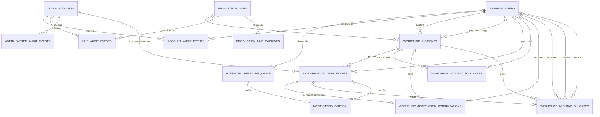
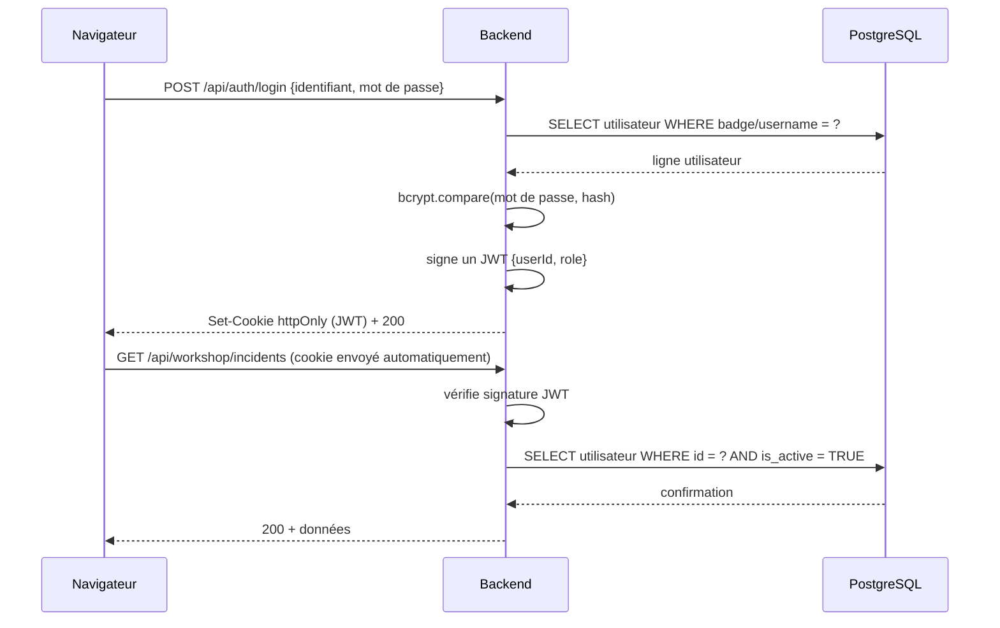

# Dossier de projet — Titre Professionnel Développeur Web et Web Mobile

> **Note de méthode (à supprimer avant dépôt final)** — Ce document est rédigé pour respecter le
> format officiel Studi (RE TP-01280) : projet réalisé pendant la formation → 4 blocs (compétences,
> expression du besoin, environnement technique, réalisations), 30 à 50 pages hors garde/sommaire/
> annexes, annexes ≤ 30 pages. Chaque bloc `[À COMPLÉTER]` indique précisément ce qu'il attend et où
> le trouver. Une fois tous les blocs remplis, supprimer cette note et la mention "brouillon" de la
> page de garde avant export PDF.

---

## Page de garde

**[À COMPLÉTER]**

- Titre : *Sentinel — Système de traçabilité et de pilotage des incidents de production industrielle*
- Sous-titre : *Dossier de projet — Titre Professionnel Développeur Web et Web Mobile*
- Votre nom, prénom
- Centre de formation (Studi), session/promotion
- Date de dépôt
- Logo du centre si exigé par le format de remise

---

## Sommaire

**[À COMPLÉTER après finalisation]** — générer la table des matières automatiquement une fois le
document mis en forme dans l'outil d'export final (Word, Google Docs), avec pagination réelle. Ne
pas la maintenir à la main dans ce brouillon Markdown.

---

## 1. Liste des compétences du référentiel couvertes par le projet

Sentinel couvre l'intégralité des deux activités types du référentiel, sur les deux blocs de
compétences (CCP1 front-end, CCP2 back-end).

| Compétence | Où elle est démontrée dans ce dossier / le code | Page |
|---|---|---|
| **CCP1 — Maquetter des interfaces utilisateur web ou web mobile** | Chapitre 5 (maquettes desktop + mobile, enchaînement des écrans, doctrine de conception documentée en `docs/doctrine-ux.md`) | [À COMPLÉTER] |
| **CCP1 — Réaliser des interfaces utilisateur statiques web ou web mobile** | Chapitre 8.1 (composants React statiques : `StarIcon`, `IncidentCard`, structure CSS en tokens) | [À COMPLÉTER] |
| **CCP1 — Développer la partie dynamique des interfaces utilisateur web ou web mobile** | Chapitre 8.2 (hooks `useIncidentPermissions`, `useHistoryData`, `useMutationFeedback` ; gestion d'état, appels API, permissions dynamiques par rôle) | [À COMPLÉTER] |
| **CCP2 — Mettre en place une base de données relationnelle** | Chapitre 6 (MCD, MLD, 14 tables applicatives, 50 migrations SQL versionnées, contraintes CHECK, index uniques) | [À COMPLÉTER] |
| **CCP2 — Développer des composants d'accès aux données SQL et NoSQL** | Chapitre 9.3 (couche `repository`, SQL paramétré, transactions ; JSONB pour `machine_sequence` et `payload` d'événement — usage NoSQL documenté dans une base relationnelle) | [À COMPLÉTER] |
| **CCP2 — Développer des composants métier côté serveur** | Chapitre 9.1-9.2 (`workshop.policy.ts`, `workshop.service.mutations.ts`, pattern `ServiceResult<T>`, validation Zod) | [À COMPLÉTER] |

**Production complémentaire** : présentation orale devant jury, support de présentation — préparés
séparément (hors de ce dossier).

---

## 2. Contexte et expression du besoin

### 2.1 Origine du projet

Sentinel n'est pas né d'une commande. Il est né d'une observation de terrain vécue directement par
l'auteur du projet, alors conducteur de ligne dans une usine d'un groupe industriel mondial
spécialisé dans la conception de cartes et systèmes électroniques pour l'automobile
*([À COMPLÉTER] — confirmer si le nom de l'entreprise doit rester anonymisé sous cette forme ou
recevoir une formulation différente ; ce dossier utilise volontairement une désignation générique
en l'absence d'accord écrit permettant de publier le nom de l'entreprise et des chiffres de
production associés dans un document remis à un jury externe)*.

Le projet a démarré comme initiative strictement personnelle en 2023, avant même le début de la
formation DWWM — sans commande, sans cahier des charges, sans sponsor hiérarchique. Il s'est
construit à partir d'une méthode d'observation directe : plusieurs semaines passées à écouter les
conducteurs de ligne, les techniciens de maintenance et les technologues, à comprendre non
seulement ce qui dysfonctionnait, mais pourquoi certains dysfonctionnements restaient invisibles
alors que d'autres déclenchaient une réaction immédiate. Cette démarche et ses résultats sont
documentés dans un cadrage conceptuel de 9 sections rédigé en amont du développement (disponible en
annexe sur demande), qui pose le problème, quantifie son impact par une méthode d'estimation
explicite (méthode de Fermi, hypothèses révisables), définit un périmètre MVP argumenté et fixe des
critères de succès mesurables à 3 et 6 mois.

Ce concept a depuis suscité l'intérêt de la R&D du site concerné, qui a manifesté le souhait d'en
prendre connaissance plusieurs mois après le départ de l'auteur de l'entreprise.

### 2.2 Le problème métier

Une machine totalement arrêtée est immédiatement visible : elle bloque la ligne, attire
l'attention, déclenche une réaction. Ce n'est pas là que se situe le problème principal. Le
problème se situe dans les deux autres états d'une tête de pose en difficulté :

1. **Arrêt machine** — visible par construction, le mieux géré, mais pas le plus fréquent.
2. **Skip déclaré** — la tête est mise hors cycle, la machine continue à produire en sous-capacité.
   Si le skip est signalé, il devient visible, mais peut rester sans traitement plusieurs jours.
   C'est la partie mesurée par l'observation de terrain (35 à 40 têtes déclarées par semaine sur le
   périmètre observé).
3. **Défauts tolérés en silence** — la tête continue de fonctionner mais génère des défauts (pièces
   manquées, positionnement dévié, précision dégradée). Le conducteur intervient seul ; si
   l'intervention échoue, deux issues possibles : déclarer le skip, ou tolérer — les défauts partent
   vers l'inspection optique finale sans que leur source soit jamais identifiée.

L'incitatif est structurellement paradoxal : déclarer un skip crée de la visibilité et une pression
de suivi ; ne pas déclarer préserve l'indicateur de cadence apparent. Le choix rationnel au niveau
individuel est souvent le pire choix au niveau du système. Ce n'est pas un problème de comportement
individuel, c'est un problème de conception d'outil — un dispositif qui rend certains problèmes peu
visibles augmente mécaniquement le risque qu'ils soient tolérés.

**Estimation d'impact** (méthode de Fermi, hypothèses explicites et révisables, sur un périmètre
observé de 11 lignes, 44 machines, 88 robots, environ 575 têtes de pose, 22 000 cartes produites par
semaine en régime continu) : la perte hebdomadaire associée aux seuls skips déclarés est estimée
entre 200 et 290 heures-machine, soit 3,5 à 5 % de la production hebdomadaire — et cette estimation
exclut structurellement les défauts tolérés en silence, dont le coût réel n'est pas mesurable sans
un outil de traçabilité.

### 2.3 Ce que Sentinel n'est pas

Le cadrage initial a délibérément posé des limites, pour éviter la dérive de périmètre classique
d'un projet industriel :

- Sentinel ne pilote pas les machines.
- Sentinel ne remplace pas l'expertise maintenance.
- Sentinel ne garantit pas l'absence d'anomalie.
- Sentinel ne se substitue pas à la décision humaine.

Ce qu'il garantit : un cadre où une anomalie ne peut pas rester invisible, non suivie, ni non
capitalisée.

### 2.4 Objectifs et limites du MVP

| Inclus dans le MVP | Hors périmètre du MVP |
|---|---|
| Signalement structuré : ligne · machine · robot · tête · type d'anomalie | Pilotage direct des machines |
| Tableau de bord partagé, actualisé en temps réel | Captation automatisée des données machine |
| Workflow complet : ouvert → priorisé → pris en charge → en attente justifiée → clôturé | Diagnostic automatisé de tête |
| Identification par badge pour toute action engageante | Analyse prédictive |
| Historique structuré et exportable | Intégration ERP / MES / GMAO en phase 1 |
| Lecture analytique : récurrences, délais, zones de perte | — |

**Pourquoi aucune automatisation machine au MVP** : le parc observé est hétérogène (marques,
générations, interfaces différentes d'une machine à l'autre), les interfaces de monitoring
disponibles ne sont pas garanties stables dans le temps (destinées au support fournisseur, pas à
l'intégration tierce), et une intégration par captation d'interface serait fragile à toute mise à
jour machine. Le choix a été de s'appuyer sur l'observation humaine — le conducteur de ligne comme
premier capteur du système — et de réserver l'automatisation machine à une itération future, une
fois la fiabilité de l'intégration démontrée machine par machine.

### 2.5 Profil des utilisateurs

Trois rôles atelier, à parité de valeur (aucun n'est secondaire par rapport aux autres) :

| Rôle | Ce qu'il apporte | Ce dont il a besoin |
|---|---|---|
| Opérateur | Signale : établit la vérité à la source | Signaler vite et juste, sans friction ni crainte de l'erreur |
| Maintenance | Intervient et documente : résout et nourrit la mémoire collective | Comprendre vite pour bien agir, transmettre ce qu'il apprend |
| Responsable | Oriente : arbitre pour le collectif | Une visibilité complète pour décider au bon moment |

Un quatrième acteur, l'administrateur système, gère le référentiel (comptes, lignes de production)
en dehors du flux opérationnel quotidien.

---

## 3. Gestion de projet

### 3.1 Méthode

Le projet a été mené en solo, sur des itérations courtes, avec discipline de commit et intégration
continue dès que le dépôt a été publié. La méthode suit un principe simple : chaque changement de
comportement observable (une fonctionnalité, une correction, un refactor structurel) donne lieu à
un commit atomique et testé — jamais un commit qui mélange plusieurs intentions. Cette discipline
est visible dans l'historique Git : par exemple, le chantier de refactor du module *Historique /
Journal / Base de connaissance* mené en juillet 2026 a été découpé en 14 commits distincts, chacun
correspondant à une correction ou une extraction précise, chacun validé par la suite de tests avant
d'être committé.

Un fichier de suivi personnel (non déposé au jury, car il contient des éléments de préparation
d'examen) a servi de feuille de route tout au long du projet, structurée en phases : hygiène du
dépôt, livrables d'examen, qualité de code, sécurité, accessibilité, démonstration, préparation
orale.

### 3.2 Planning réel

**[À COMPLÉTER]** — dates réelles de début et de fin, rythme de travail hebdomadaire (heures par
semaine, jours dédiés), grands jalons (première version fonctionnelle, premier déploiement, phase
de durcissement sécurité/qualité, phase de préparation du dossier). Vous êtes seul à connaître cette
chronologie ; elle doit rester honnête (elle sera confrontée à l'historique Git en cas de question
du jury). Un export `git log --format='%ad' --date=short | sort -u` donne les dates réelles de
commit si besoin de rafraîchir la mémoire.

### 3.3 Outils

- **Gestion de version** : Git, dépôt hébergé sur GitHub (`sentinel-fullstack`)
- **Intégration continue** : GitHub Actions — lint, build TypeScript, tests (Jest côté backend,
  Vitest côté frontend), audit de dépendances npm, build des images Docker, exécutés à chaque push
  et pull request vers `main`
- **Suivi de tâches** : feuille de route personnelle en Markdown (phases, priorités, critères de
  validation par tâche)
- **Environnement de développement** : VS Code, Node.js 20, Docker Compose pour l'environnement
  local complet (PostgreSQL, backend, frontend, reverse proxy)

### 3.4 Environnement humain

**[À COMPLÉTER]** — projet mené seul (formation, pas d'équipe) ; mentionner ici le rôle des
formateurs Studi si des retours ont été sollicités (dépôt d'entraînement, sessions de mentorat), et
tout retour informel obtenu (l'échange avec la R&D évoqué au chapitre 2, s'il y a eu un retour
substantiel sur le concept à mentionner ici plutôt qu'au chapitre 2).

---

## 4. Environnement technique

### 4.1 Vue d'ensemble

Sentinel est une application full-stack organisée en monorepo à deux workspaces (`backend/` et
`frontend/`), orchestrés par Docker Compose et exposés derrière un reverse proxy.

```
┌─────────────────────────────────────────────────────┐
│                    NAVIGATEUR                        │
│           React 18 + TypeScript + Vite               │
└────────────────────────┬───────────────────────────-─┘
                          │ HTTP / JSON
                          │ JWT en cookie HTTP-only
┌────────────────────────▼───────────────────────────-─┐
│                    BACKEND                            │
│           Node.js + Express + TypeScript              │
└────────────────────────┬───────────────────────────-─┘
                          │ SQL paramétré
┌────────────────────────▼───────────────────────────-─┐
│                BASE DE DONNÉES                        │
│               PostgreSQL 15                           │
└────────────────────────────────────────────────────-─┘
```

### 4.2 Stack backend

| Choix | Alternative écartée | Pourquoi |
|---|---|---|
| Node.js 20 + Express + TypeScript | NestJS, Fastify | Contrôle direct de chaque couche, pas de convention imposée à apprendre, adapté à la taille du projet |
| SQL brut (`pg`, requêtes paramétrées) | ORM (Prisma, TypeORM) | Contrôle total des requêtes, en particulier pour les requêtes analytiques complexes du module Pilotage ; élimine une couche d'abstraction sans bénéfice mesurable à cette échelle |
| Zod | Joi, validation manuelle | Schémas déclaratifs typés, partagés entre validation d'entrée et types TypeScript |
| JWT en cookie HTTP-only | JWT en `localStorage` | Protection native contre le vol de token par XSS — un script injecté ne peut pas lire un cookie `httpOnly` |
| bcrypt | argon2 | Standard éprouvé, support mature en Node, coût de calcul paramétrable (10 rounds atelier, 12 rounds admin) |
| Migrations SQL numérotées, sans rollback | Outil de migration à état (Prisma Migrate) | Traçabilité simple et lisible, chaque migration est un fichier `.sql` autoportant, appliqué une seule fois et enregistré en base |

### 4.3 Stack frontend

| Choix | Alternative écartée | Pourquoi |
|---|---|---|
| React 18 + TypeScript + Vite | Next.js | Application 100 % client (SPA), pas de besoin de rendu serveur ; Vite offre un temps de démarrage et de rebuild nettement plus rapide en développement |
| `fetch` natif | Axios | Pas de dépendance supplémentaire pour un besoin simple (base URL, cookies, gestion d'erreur centralisée dans un seul wrapper) |
| CSS en tokens (variables custom properties), pas de framework | Tailwind, Bootstrap | Contrôle total de la grammaire visuelle (une doctrine de design a été rédigée en amont, `docs/doctrine-ux.md`), pas de classes utilitaires à mémoriser, cohérence garantie par les tokens plutôt que par convention |
| React Router 6 | — | Standard du marché pour le routage SPA |

### 4.4 Infrastructure et déploiement

- **Conteneurisation** : Docker Compose, 4 services — PostgreSQL, backend, frontend (servi par
  Nginx), reverse proxy Caddy (seul service exposant des ports sur l'hôte, TLS automatique)
- **Environnement de production** : VPS Linux, domaine dédié (`sentinel.akiksystems.fr`)
- **CI/CD** : GitHub Actions, déclenché sur chaque push/pull request vers `main`
- **Base de données** : PostgreSQL 15, migrations appliquées automatiquement au démarrage du
  backend, volume Docker persistant, sauvegarde par `pg_dump`

**[À COMPLÉTER]** — capture d'écran de l'environnement de déploiement si souhaité (dashboard VPS,
sortie de `docker compose ps`), non indispensable mais valorisante pour montrer la maîtrise
opérationnelle.

---

## 5. Réalisations — Maquettes et enchaînement des interfaces

### 5.1 Démarche de maquettage

Sentinel étant déjà déployé en production (`sentinel.akiksystems.fr`), la démarche de maquettage
suit une méthode d'import-annotation plutôt qu'un maquettage à blanc : les interfaces réelles sont
importées dans un outil de maquettage (extension html.to.design vers Figma), puis retravaillées —
grille de mise en page annotée, zones commentées, au moins une variante d'écran alternative montrée
pour prouver un vrai travail de conception et non un simple export. Cette méthode est cohérente avec
le fait que Sentinel a d'abord été pensé (cadrage conceptuel, doctrine UX écrite en amont du code —
voir §5.2) avant d'être codé : les maquettes rendent visible une intention de conception déjà
présente dans le projet, elles ne sont pas produites après coup pour combler une exigence
d'examen.

**[À COMPLÉTER — entièrement à votre charge]** Liste des écrans à capturer puis importer, avec
leur rôle dans le récit de maquettage (voir `docs/dossier-projet/liste-captures-a-realiser.md`
pour le détail exact — url, état à afficher, ce que chaque capture doit démontrer) :

- Portail `/login` (3 blocs Board / Administration / Workshop)
- Connexion atelier (les 2 états : première connexion avec setup code, connexion standard)
- Dashboard atelier — vu par un OPERATOR, un MAINTENANCE, un RESPONSABLE (3 captures, permissions
  visiblement différentes)
- Modale de création d'incident
- Board grand écran
- Pilotage (indicateurs)
- Historique (dossier incident) et Journal (vue Responsable)
- Base de connaissance
- Admin : liste des utilisateurs, détail d'un compte, gestion des lignes

Au moins 4 de ces écrans en version mobile (portail, dashboard, création d'incident, board), viewport
capturé avant import.

### 5.2 Doctrine de conception (argumentaire des choix)

Les choix d'interface ne sont pas laissés à l'appréciation esthétique : une doctrine de conception
a été rédigée en amont (`docs/doctrine-ux.md`, 380 lignes), qui pose des principes vérifiables
plutôt que des préférences. Extrait des principes directeurs :

- **Hiérarchie sans agression** — l'information importante se distingue par le contraste et la
  position, jamais par la saturation maximale ou le clignotement. Un stress visuel dégrade la
  décision, il ne l'oriente pas.
- **Le silence par défaut** — l'état normal d'une interface est calme ; aucun élément n'est affiché
  sans usage réel.
- **La couleur comme langage** — un même niveau d'enjeu produit toujours le même traitement visuel
  dans toute l'application (tokens `--attention-calm/-watch/-act/-critical` centralisés).
- **Le temps comme matière** — l'ancienneté d'un incident est rendue sensible (« depuis 3 h »,
  « depuis 8 j ») et module le niveau d'attention de façon progressive, jamais par un seuil brutal.

Cette doctrine a fait l'objet d'un audit de conformité complet, écran par écran, documenté dans
`docs/plan-ux.md` (245 lignes), avec un tableau de bord de chantier traçant chaque lot de correction
appliqué et sa justification par principe.

### 5.3 Schéma d'enchaînement des maquettes

Les trois flux sont déterminés par les routes et leurs gardes React :

```mermaid
flowchart LR
    P[Portail /login]
    P --> B[/board]
    B --> BS{Session autorisée}
    BS -->|Code Board valide| BV[Board en lecture seule]
    BS -->|Session Workshop valide| BV

    P --> AL[/admin/login]
    AL --> AA[Authentification Administration]
    AA --> AH[/admin/accueil]
    AH --> AU[Comptes]
    AH --> AR[Lignes]
    AH --> AJ[Audits et paramètres]

    P --> WL[/workshop/login]
    WL --> WA{Authentification par badge}
    WA -->|Premier accès| WS[Code temporaire et nouveau mot de passe]
    WA -->|Accès courant| WP[Mot de passe]
    WS --> WD[/workshop/dashboard]
    WP --> WD
    WD --> WPI[Pilotage]
    WD --> WH[Historique]
    WD --> WK[Connaissance et support]
    WD --> WJ[Journal RESPONSABLE]
```

Le Board exige donc soit une session locale créée par un code valide, soit une
session Workshop valide. Les routes Administration utilisent `AdminRoute`; les
routes Atelier utilisent `WorkshopRoute`, avec une garde RESPONSABLE
supplémentaire pour le Journal.

---

## 6. Conception de la base de données

### 6.1 Choix technique

PostgreSQL 15, SQL brut sans ORM. Les données de Sentinel sont fortement relationnelles (incidents
liés à des lignes, des machines, des utilisateurs, des événements) ; le SQL paramétré donne un
contrôle total sur les requêtes, en particulier pour les requêtes analytiques du module Pilotage
(agrégations, percentiles, tendances journalières) qu'un ORM classique exprimerait plus
difficilement. Les valeurs issues des requêtes utilisent des paramètres liés
(`$1`, `$2`, ...`) ; les rares fragments structurels dynamiques proviennent de
listes internes contrôlées. Ce contrat est argumenté au chapitre 10 (Sécurité).

### 6.2 Modèle conceptuel de données (MCD)

Le MCD comporte quatorze tables applicatives. La table technique
`schema_migrations` est présentée séparément dans le MPD. Le diagramme ci-dessous
résume les relations ; les attributs et nullabilités ainsi que les principales
contraintes sont maintenus dans `docs/dossier-projet/schemas-mermaid.md`. Cette
source est vérifiée contre les migrations `001` à `050`.



### 6.3 Justification du choix JSONB

Neuf colonnes JSONB servent quatre usages documentaires locaux dans un schéma
relationnel :

**`production_lines.machine_sequence` et `production_line_machines.payload`** —
la première conserve l'agrégat ordonné d'une ligne ; la seconde est sa projection
normalisée, maintenue par trigger et validée par les fonctions SQL de la migration
`043`.

**`workshop_incidents.edit_request` et `workshop_arbitration_cases.payload`** —
une proposition de correction structurée et son cas d'arbitrage conservent les
snapshots avant/demandé.

**Les payloads d'audit** — `workshop_incident_events.payload`,
`account_audit_events.changes`, `line_audit_events.changes` et
`admin_system_audit_events.changes` portent un contexte variable. Pour
`workshop_incident_events.payload`, chaque type d'événement d'audit (prise en charge,
changement de priorité, demande de correction...) porte un contexte différent (valeur avant/après,
motif, champs modifiés). Une colonne JSONB générique évite de créer une colonne par type de donnée
possible ou une table par type d'événement, tout en gardant chaque événement interrogeable
(`payload->>'reason'`) si un besoin d'analyse futur l'exige.

**`notification_outbox.delivered_recipients`** — une carte canal → destinataires
déjà servis empêche de rejouer une livraison confirmée lors d'une reprise
partielle.

Dans les quatre usages, JSONB reste un choix local et documenté, pas une fuite de modélisation : le
reste du schéma est strictement relationnel, avec clés étrangères et contraintes
d'intégrité explicites (voir §6.5).

### 6.4 Modèle logique / physique de données (MLD/MPD)

Le MPD versionné compte quatorze tables applicatives et la table technique
`schema_migrations`. Sa source Mermaid complète se trouve dans
`docs/dossier-projet/schemas-mermaid.md` ; elle énumère les types, clés,
nullabilités et principales contraintes des migrations `001` à `050`. Un export
SVG peut être produit pour la mise en page sans modifier cette source.

Dictionnaire de données des tables centrales :

**`workshop_incidents`** (table pivot du domaine métier)

| Colonne | Type | Contrainte |
|---|---|---|
| `id` | SERIAL | PRIMARY KEY |
| `user_id` | INTEGER | FK → `sentinel_users(id)`, déclarant |
| `line_id`, `line_number` | INTEGER, VARCHAR | ligne concernée |
| `machine_id`, `robot_label`, `head_number` | VARCHAR, VARCHAR, INTEGER | localisation exacte de l'anomalie |
| `state` | VARCHAR | CHECK ∈ {SKIPEE_PAR_MACHINE, SKIPEE_PAR_CONDUCTEUR, DEGRADEE, INDISPONIBLE} |
| `status` | VARCHAR | CHECK ∈ {OPEN, PENDING, CLOSED, CANCELED, INVALIDATED}, défaut OPEN |
| `is_taken`, `taken_by_user_id`, `taken_at` | BOOLEAN, INTEGER, TIMESTAMPTZ | prise en charge, cohérence imposée par `chk_taken_consistency` |
| `waiting_reason`, `diagnostic`, `intervention_note`, `responsible_comment` | TEXT | `waiting_reason` requis par `SET_PENDING`, `intervention_note` requise par `CLOSE` ; `diagnostic` est historique, facultatif et en lecture seule dans l'API courante |
| `edit_request` | JSONB | demande de correction en attente, CHECK de forme (`chk_edit_request_shape`) |

Contrainte notable : `idx_unique_active_incident_per_machine`, un index unique partiel garantissant
qu'une même position machine (ligne, machine, robot, tête) ne peut avoir qu'un seul incident actif
(`OPEN` ou `PENDING`) à la fois — empêche la déclaration en doublon au niveau base de données, pas
seulement au niveau applicatif.

**`workshop_incident_events`** (journal append-only par convention applicative) —
une ligne par action significative sur un incident, avec un acteur Atelier,
Administration ou système et ses snapshots. Aucune immuabilité PostgreSQL
absolue n'est revendiquée.

### 6.5 Script de création

Le schéma complet est versionné dans `backend/migrations/`, 50 fichiers SQL numérotés séquentiellement,
chacun appliqué une seule fois et enregistré dans une table `schema_migrations`. Extrait représentatif
(migration `017_enforce_taken_consistency.sql`, qui durcit un invariant métier a posteriori) :

```sql
ALTER TABLE workshop_incidents
  ADD CONSTRAINT chk_taken_consistency CHECK (
    (is_taken = FALSE AND taken_by_user_id IS NULL AND taken_at IS NULL)
    OR
    (is_taken = TRUE AND taken_by_user_id IS NOT NULL AND taken_at IS NOT NULL)
  );

ALTER TABLE workshop_incidents
  ADD CONSTRAINT chk_pending_must_be_taken CHECK (
    status != 'PENDING' OR is_taken = TRUE
  );
```

---

## 7. Diagrammes UML

Les sources Mermaid prêtes à exporter sont consolidées dans
`docs/dossier-projet/schemas-mermaid.md`. Trois diagrammes couvrent le cœur métier :

1. **Diagramme de cas d'utilisation** — 3 rôles atelier (Opérateur, Maintenance, Responsable) + 1
   administrateur système, chacun avec ses actions propres.
2. **Diagramme de séquence** du workflow incident complet : création → prise en charge → mise en
   attente avec motif → reprise → clôture avec note d'intervention, avec les échanges
   frontend/backend/base de données à chaque étape.
3. **Diagramme d'états** de l'incident, transcription directe du document `INCIDENT_LIFECYCLE.md`
   déjà maintenu dans le dépôt (5 statuts, transitions strictement contrôlées par la matrice de
   permissions du chapitre 9).

---

## 8. Réalisations front-end

### 8.1 Interfaces statiques

Les composants d'affichage sont conçus pour être des unités de présentation pures, sans logique
métier — la logique de permission et de calcul d'état est extraite dans des hooks dédiés (§8.2),
les composants ne font que traduire une donnée déjà préparée en HTML. Extrait représentatif
(`frontend/src/components/icons/StarIcon.tsx`, un composant SVG partagé extrait pour éliminer une
duplication entre deux écrans qui affichaient chacun leur propre icône de suivi) :

```tsx
export default function StarIcon({ filled }: { filled: boolean }) {
  return (
    <svg
      width="16"
      height="16"
      viewBox="0 0 24 24"
      fill={filled ? 'currentColor' : 'none'}
      stroke="currentColor"
      strokeWidth="2"
      strokeLinecap="round"
      strokeLinejoin="round"
      aria-hidden="true"
    >
      <polygon points="12 2 15.1 8.3 22 9.3 17 14.1 18.2 21 12 17.8 5.8 21 7 14.1 2 9.3 8.9 8.3 12 2" />
    </svg>
  );
}
```

La grammaire visuelle repose sur des tokens CSS centralisés (`--attention-calm`, `--attention-watch`,
`--attention-act`, `--attention-critical`) plutôt que sur des couleurs codées en dur composant par
composant — un même niveau d'enjeu produit toujours le même traitement visuel dans toute
l'application, ce qui rend la cohérence vérifiable plutôt que dépendante de la mémoire du
développeur.

**[À COMPLÉTER]** captures d'écran des interfaces statiques réelles (desktop + mobile) — voir
`liste-captures-a-realiser.md`.

### 8.2 Interfaces dynamiques

La logique dynamique (état, appels API, permissions conditionnelles) est isolée dans des hooks React
personnalisés, réutilisables et testables indépendamment du rendu. Extrait représentatif
(`frontend/src/hooks/useIncidentPermissions.ts`), qui centralise 13 vérifications de permission
auparavant calculées en série directement dans le composant d'affichage :

```tsx
export function useIncidentPermissions(
  incident: WorkshopIncident,
  userRole: Role | undefined,
  userId: number | undefined,
  isResponsable: boolean
) {
  const canRequestEdit = canPerform(userRole, 'requestEdit', incident, userId);
  const canDirectEdit = canPerform(userRole, 'directEdit', incident);
  const canTake = canPerform(userRole, 'take', incident);
  const canClose = canPerform(userRole, 'close', incident);
  // ... 9 autres vérifications

  const hasWorkflowActions = canTake || canSetPending || canResume || canClose || canSetPriority;
  const hasDangerActions = canRequestCancel || canCancel || canInvalidateClosed;

  return { canRequestEdit, canDirectEdit, canTake, canClose, hasWorkflowActions, hasDangerActions, /* ... */ };
}
```

Ce hook illustre un principe appliqué dans tout le frontend : **la sécurité d'affichage suit
exactement la même logique que la sécurité serveur** (`canPerform`, importé depuis
`utils/workshopPermissions.ts`, miroir volontaire de `workshop.policy.ts` côté backend — voir §9.1).
Un bouton qui n'apparaît pas côté client n'est jamais la seule protection : la même règle est
revérifiée côté serveur avant toute mutation (argumenté au chapitre 10, sécurité).

Un autre hook représentatif, `useHistoryData.ts`, illustre la gestion de la concurrence réseau :
chaque recherche texte est débouncée (250 ms) et chaque requête en vol est annulée
(`AbortController`) si l'utilisateur retape avant la réponse — sans cela, une réponse réseau lente
peut arriver après une réponse plus récente et afficher un résultat incohérent avec les filtres
visibles à l'écran. Ce correctif a été identifié et appliqué lors d'un audit systématique du module
Workshop en juillet 2026 (voir historique Git, commit *"fix(workshop): debounce + annulation réseau
sur la recherche serveur"*).

**[À COMPLÉTER]** captures d'écran illustrant un état dynamique (ex. filtre appliqué, permissions
différentes selon le rôle connecté).

---

## 9. Réalisations back-end

### 9.1 Composants métier — la matrice de permissions

`backend/src/modules/workshop/workshop.policy.ts` est la source de vérité serveur
des actions incident énumérées par `canPerform`. La création est ouverte aux
trois rôles Atelier authentifiés ; le suivi explicite est contrôlé séparément par
les services `followIncidentService` et `unfollowIncidentService`.

| Action | OPERATOR | MAINTENANCE | RESPONSABLE |
|---|:---:|:---:|:---:|
| Créer un incident | oui | oui | oui |
| Demander/retirer la correction de sa déclaration active | oui | non | non |
| Demander/retirer l'annulation de sa déclaration non prise | oui | non | non |
| Modifier un actif non pris | non | oui | oui |
| Modifier un actif pris | non | affecté uniquement | oui |
| Prendre/transférer un incident `OPEN` | non | oui | non |
| Mettre en attente, reprendre ou clôturer | non | oui | non |
| Annuler un actif non pris | non | oui | oui |
| Annuler un incident `PENDING` | non | non | oui |
| Arbitrer une correction ou une annulation | non | non | oui |
| Définir priorité/consigne, invalider une clôture | non | non | oui |
| Activer ou retirer son suivi | non | non | oui |

Les conditions fines d'appartenance, de statut, de prise et d'arbitrage ouvert
restent appliquées à chaque ligne. Un suivi ne peut être activé que sur un
incident actif ; son retrait reste possible après passage à un statut terminal.
Par exemple, l'annulation directe refuse également tout arbitrage incompatible :

```typescript
case 'CANCEL':
  if (incident.status === 'PENDING') {
    return workshopRole === 'RESPONSABLE' && !hasPendingArbitration(incident);
  }
  return (
    isActiveIncident(incident) &&
    !hasPendingArbitration(incident) &&
    !incident.is_taken &&
    (workshopRole === 'RESPONSABLE' || workshopRole === 'MAINTENANCE')
  );
```

Ce fichier est répliqué côté frontend (`utils/workshopPermissions.ts`) pour l'expérience utilisateur
(griser un bouton plutôt que laisser l'utilisateur découvrir un refus après coup), mais le frontend
n'est jamais la source de vérité : toute action passe par `canPerform` côté serveur avant
d'atteindre la base de données, quel que soit ce que l'interface affichait.

### 9.2 Composants métier — un service avec transaction

`followIncidentService` illustre le pattern transactionnel des mutations du
domaine : lecture avec verrou, vérification métier, écriture et, seulement en cas
de changement, journalisation d'audit dans la même transaction :

```typescript
export async function followIncidentService(
  incidentId: number,
  actorUserId: number,
  actorRole: string
): Promise<ServiceResult<unknown>> {
  if (actorRole !== 'RESPONSABLE') return forbidden('Seul le responsable peut suivre un incident.');

  const result = await withTransaction(async (client) => {
    const current = await workshopRepository.getIncidentById(incidentId, client);
    if (!current) return { kind: 'not_found' as const };
    if (current.status === 'CLOSED' || current.status === 'CANCELED' || current.status === 'INVALIDATED') {
      return { kind: 'forbidden' as const };
    }
    const changed = await workshopRepository.followIncidentData(
      incidentId,
      actorUserId,
      client
    );
    if (changed) {
      await logIncidentEvent(
        incidentId,
        actorUserId,
        'INCIDENT_FOLLOWED',
        {},
        client
      );
    }
    return { kind: 'ok' as const };
  });

  if (result.kind === 'not_found') return notFound('Incident introuvable.');
  if (result.kind === 'forbidden') return forbidden('Impossible de suivre un incident terminé.');
  return { ok: true, data: await workshopRepository.fetchIncidentWithUsersForActor(incidentId, actorUserId) };
}
```

`getIncidentById(id, client)` exécute un `SELECT ... FOR UPDATE` : la ligne est verrouillée pour la
durée de la transaction, ce qui empêche qu'un autre acteur modifie le statut de l'incident entre la
lecture et l'écriture. Ce point a fait l'objet d'une correction ciblée en juillet 2026 : deux
fonctions (`followIncidentService`, `unfollowIncidentService`) lisaient l'état hors transaction avant
d'écrire dans une transaction séparée — fenêtre de course réelle avec plusieurs responsables actifs
simultanément — alignées ensuite sur le pattern déjà utilisé partout ailleurs dans le module.

Le suivi est un opt-in : seul cet appel explicite à
`followIncidentData` l'active. La création, la priorité, la consigne et les
décisions d'arbitrage n'ajoutent aucun follower.

### 9.3 Composants d'accès aux données

Les repositories concentrent le SQL métier. Des composants transversaux
d'authentification, de notification et de journalisation interrogent aussi
PostgreSQL directement. Les valeurs externes sont liées comme paramètres ; les
fragments structurels éventuels proviennent de listes internes contrôlées :

```typescript
export async function getIncidentById(
  incidentId: number,
  client?: PoolClient
): Promise<WorkshopIncidentRow | null> {
  const db = client ?? pool;
  const { rows } = await db.query('SELECT * FROM workshop_incidents WHERE id = $1 FOR UPDATE', [
    incidentId,
  ]);
  return rows[0] ?? null;
}
```

Un exemple de requête analytique complexe (module Pilotage) illustre l'intérêt du SQL brut par
rapport à un ORM : agrégation de percentiles et de tendances journalières via des CTE (Common Table
Expressions), difficilement exprimables de façon lisible avec un ORM classique — extrait de
`workshop.repository.analytics.ts` :

```sql
WITH filtered_incidents AS (
  SELECT wi.id, wi.created_at, wi.taken_at, wi.is_priority
  FROM workshop_incidents wi
  WHERE wi.created_at >= $1 AND wi.created_at <= $2
),
day_keys AS (
  SELECT date_trunc('day', created_at)::date AS day FROM filtered_incidents
)
SELECT
  dk.day::text AS day,
  percentile_cont(0.5) WITHIN GROUP (
    ORDER BY EXTRACT(EPOCH FROM (fi.taken_at - fi.created_at))
  ) AS median_take_seconds
FROM day_keys dk
LEFT JOIN filtered_incidents fi ON TRUE
GROUP BY dk.day
ORDER BY dk.day ASC;
```

### 9.4 Validation des entrées

Chaque route reçoit des données validées par un schéma Zod avant tout traitement métier :

```typescript
export const createIncidentSchema = z.object({
  lineId: z.coerce.number().int().positive(),
  machineId: z.string().trim().min(1).max(FIELD_LIMITS.MACHINE_ID),
  robotLabel: z.string().trim().min(1).max(FIELD_LIMITS.ROBOT),
  headNumber: z.coerce.number().int().min(1, "La tête doit correspondre au référentiel de la machine."),
  state: IncidentStateEnum,
  comment: z.string().trim().max(FIELD_LIMITS.COMMENT).optional(),
  currentProduct: z.string().trim().min(1, "Le produit en cours est obligatoire.").max(FIELD_LIMITS.PRODUCT),
});
```

Les limites de longueur (`FIELD_LIMITS`) sont une source unique de vérité partagée entre le schéma
de validation backend et les attributs `maxLength` côté frontend — pas de duplication de constantes
susceptible de diverger.

### 9.5 Le pattern `ServiceResult<T>`

Toutes les fonctions de service retournent un type uniforme plutôt que de lever des exceptions pour
les erreurs métier :

```typescript
type ServiceResult<T> =
  | { ok: true; data: T }
  | { ok: false; status: number; code: ErrorCode; message: string };
```

Le contrôleur sait toujours comment répondre (`if (sendServiceError(res, result)) return;`), et il
est structurellement impossible d'utiliser un code d'erreur qui n'existe pas — le typage TypeScript
le refuserait à la compilation. Ce chantier a lui-même fait l'objet d'une correction en juillet
2026 : 8 fonctions de lecture (listes d'incidents, métriques, analytics) ne suivaient pas encore ce
pattern et renvoyaient une valeur brute — elles ne pouvaient donc jamais renvoyer d'erreur typée,
seulement un succès ou une erreur 500 générique. Elles ont été alignées sur le pattern uniforme,
avec mise à jour des tests correspondants dans le même commit.

---

## 10. Sécurité de l'application

La sécurité est traitée comme un fil rouge du projet, pas comme un chapitre isolé ajouté à la fin.
Chaque mesure ci-dessous est vérifiable directement dans le code cité.

### 10.1 Authentification et gestion de session

- **Transport** : JWT signé, transmis uniquement via cookie `httpOnly`, jamais exposé dans le corps
  d'une réponse JSON — un script injecté côté client (XSS) ne peut pas lire le token.
- **Durée de session** : 8 heures, avec vérification en base à chaque requête (pas seulement
  vérification de signature) : le middleware `workshopAuthMiddleware` reconfirme que l'utilisateur
  est toujours actif, non supprimé, et que son mot de passe n'a pas été réinitialisé entre-temps —
  un compte désactivé par l'administrateur perd sa session immédiatement, pas seulement à
  l'expiration du token.
- **Hachage des mots de passe** : bcrypt, 10 rounds pour les comptes atelier, 12 rounds pour le
  compte administrateur (surface d'attaque plus sensible).
- **Premier accès** : code de configuration à usage unique (10 caractères, alphabet réduit à 32
  symboles sans ambiguïté visuelle, ~50 bits d'entropie, expiration 24 h, jamais stocké en clair —
  seul un hash bcrypt est conservé).

### 10.2 Tableau OWASP Top 10 — mesures Sentinel

| Risque OWASP | Mesure Sentinel |
|---|---|
| A01 — Contrôle d'accès défaillant | Matrice de permissions à deux niveaux (`workshop.policy.ts` source de vérité serveur, miroir frontend cosmétique) ; chaque action revalidée côté serveur indépendamment de l'affichage |
| A02 — Défaillances cryptographiques | bcrypt pour tous les mots de passe, JWT signé, secrets ≥ 24 caractères imposés en production (le serveur refuse de démarrer sinon) |
| A03 — Injection | Valeurs SQL liées (`$1`, `$2`, ...`), fragments structurels limités à des choix internes contrôlés et validation Zod en entrée |
| A04 — Conception non sécurisée | Contraintes d'intégrité au niveau base de données en plus de la validation applicative (ex. `chk_taken_consistency`) — la donnée reste cohérente même en cas de bug applicatif |
| A05 — Mauvaise configuration de sécurité | Headers de sécurité systématiques (CSP, `X-Frame-Options: DENY`, `X-Content-Type-Options: nosniff`, HSTS en production) ; configuration de production validée au démarrage (`assertProductionConfig`) |
| A07 — Erreurs d'identification | Rate limiting sur le login (10 échecs / 5 minutes par IP + identité), verrouillage de session admin après 3 échecs de vérification de mot de passe |
| A08 — Intégrité des données | Événements ajoutés en append-only par les services, acteur et snapshots capturés au moment de l'action ; aucune immutabilité PostgreSQL absolue revendiquée |
| A09 — Carences de journalisation | Chaque action métier significative génère un événement d'audit horodaté et attribué |

### 10.3 Flux d'authentification (JWT + cookie)

Le flux simplifié ci-dessous est complété par les séquences Administration,
Workshop et Board de `docs/dossier-projet/schemas-mermaid.md`. La séquence Board
y documente le hash bcrypt courant, la compatibilité SHA-256 avec mise à niveau
automatique et la durée `0` sans expiration automatique.



### 10.4 Veille sécurité

**[À COMPLÉTER — entièrement personnel]** Décrivez ici votre démarche réelle de veille : sources que
vous suivez effectivement (par exemple OWASP, les avis npm/`npm audit`, CERT-FR/ANSSI, des comptes
ou newsletters spécifiques), à quelle fréquence, et si possible un exemple concret vécu pendant ce
projet (une alerte `npm audit` traitée, une CVE suivie, une lecture qui a changé une décision
technique). C'est un point que le jury interroge souvent à l'oral — mieux vaut un exemple modeste
mais réellement vécu qu'une liste de sources jamais consultées en pratique.

Dependabot est déjà activé sur le dépôt (`.github/dependabot.yml`, surveillance hebdomadaire npm
côté backend et frontend) — c'est un point de départ factuel, à compléter par votre pratique
personnelle.

---

## 11. RGPD

### 11.1 Données personnelles traitées

Sentinel traite un minimum de données personnelles, strictement nécessaires au fonctionnement :
prénom, nom, numéro de badge professionnel et rôle pour les comptes atelier ; nom d'utilisateur
pour les comptes administrateur. Une adresse e-mail professionnelle peut être ajoutée de manière
facultative à chacun de ces types de comptes. Le champ des comptes atelier est destiné à recevoir
une adresse fournie par l'entreprise ; son absence n'empêche pas l'authentification par badge et
mot de passe. Une adresse professionnelle nominative reste une donnée personnelle dès lors qu'elle
permet d'identifier une personne.

Les incidents, leurs événements et les journaux d'administration enregistrent également les
informations nécessaires à l'attribution et à l'horodatage des actions. Sentinel ne collecte
aucune donnée biométrique, photo ou donnée de géolocalisation et n'utilise aucun dispositif de
suivi publicitaire.

### 11.2 Base légale

Le responsable de traitement est l'entreprise ou l'établissement qui exploite l'instance Sentinel
et en détermine les usages. L'administrateur de l'application agit pour son compte dans la gestion
technique des utilisateurs, des habilitations et des paramètres ; il n'est pas, du seul fait de ce
rôle, responsable de traitement.

Dans le contexte d'une entreprise privée, le traitement peut reposer sur l'intérêt légitime de
l'employeur à assurer le suivi de production, la continuité des interventions et leur traçabilité,
dans le cadre strict de l'activité professionnelle. Cette base doit être confirmée et documentée
par l'entreprise exploitante : nécessité du traitement, proportionnalité des données conservées et
mise en balance avec les droits et libertés des salariés.

### 11.3 Minimisation

L'adresse e-mail professionnelle est facultative et n'est pas un identifiant de connexion. Lorsqu'un
compte atelier actif en possède une, elle peut recevoir des notifications opérationnelles ciblées
selon le rôle de l'utilisateur ou son lien avec un incident : demande d'arbitrage, urgence, prise en
charge, changement de statut, consigne responsable ou résultat d'une demande. Elle n'est utilisée
ni à des fins commerciales, ni à des fins publicitaires.

La récupération d'accès suit un circuit séparé : une demande de réinitialisation d'un compte
atelier est enregistrée pour être traitée par l'administrateur. Si le canal correspondant est
activé et qu'une adresse d'administration est configurée, une alerte peut également y être envoyée.
L'administrateur génère ensuite un nouveau code temporaire. L'adresse facultative du compte atelier
n'est donc pas utilisée comme canal direct de récupération du mot de passe.

Les destinataires sont limités aux administrateurs habilités et aux utilisateurs concernés selon
leur rôle ou leur implication dans l'incident. Si l'envoi d'e-mails est activé, le prestataire SMTP
configuré traite les données strictement nécessaires à l'acheminement des messages pour le compte
de l'entreprise exploitante. Les données ne sont ni vendues ni cédées à des fins de prospection.

### 11.4 Durée de conservation et droit à l'effacement

**Implémentation en place** (`sentinel_users.is_deleted`, `deleted_at`) : la désactivation d'un
compte bloque son accès et son éligibilité aux notifications opérationnelles, sans effacer ses
données. Sa suppression par l'administrateur pseudonymise le compte opérationnel (nom et prénom
génériques, badge neutre) et supprime l'adresse e-mail ainsi que les éléments d'authentification.
L'identifiant technique est conservé afin de préserver l'intégrité référentielle.

Cette suppression ne réécrit pas l'ensemble du passé. Depuis les migrations 025 à 028, les
incidents et événements d'audit figent certaines informations professionnelles au moment de
l'action : nom, prénom, rôle et, selon l'enregistrement, numéro de badge. Ces snapshots permettent
de conserver un journal factuel ajouté en append-only par les services ; ils
peuvent donc rester visibles après la suppression du compte opérationnel. Leur
accès est restreint aux rôles habilités.

Sentinel n'applique actuellement aucun délai automatique de purge à ces historiques. Il appartient
à l'entreprise responsable de traitement de définir et documenter une politique de conservation
proportionnée à ses obligations de traçabilité, puis d'organiser l'effacement ou l'anonymisation des
traces qui ne sont plus nécessaires. Cette limite doit être présentée honnêtement : la suppression
du compte retire les moyens de contact et d'authentification, mais ne garantit pas l'effacement
immédiat de toute identité déjà figée dans les journaux.

### 11.5 Droits des personnes

- **Accès et rectification** : la demande est adressée à l'entreprise responsable de traitement ;
  l'administrateur dispose des outils nécessaires pour corriger le compte courant. La rectification
  ne réécrit pas rétroactivement les snapshots historiques.
- **Effacement, limitation et opposition** : ces demandes sont examinées par l'entreprise dans les
  conditions prévues par le RGPD, en tenant compte des besoins de traçabilité et des obligations
  applicables. La suppression logique décrite au §11.4 constitue le mécanisme technique disponible
  pour le compte opérationnel.
- **Information** : la page publique `/confidentialite` décrit les données traitées, l'usage des
  e-mails professionnels, les destinataires, la conservation et les droits.
- **Réclamation** : la personne concernée peut saisir la CNIL si elle estime, après avoir contacté
  l'entreprise, que ses droits ne sont pas respectés.

---

## 12. Jeu d'essai

Fonctionnalité testée : le cycle de vie complet d'un incident d'atelier — la fonctionnalité la plus
représentative de l'application, car elle traverse les 4 couches du backend (route, contrôleur,
service, repository), la matrice de permissions et l'audit trail. Jeu d'essai exécuté contre l'API
réelle (Express + PostgreSQL), données et réponses ci-dessous reprises telles qu'obtenues.

### Données de test

| Élément | Valeur |
|---|---|
| Ligne de production | 1 ligne de test, 1 machine, robot avec 4 têtes |
| Opératrice | rôle OPERATOR |
| Technicien | rôle MAINTENANCE |
| Responsable | rôle RESPONSABLE |

### Scénario — Cycle de vie complet

| Étape | Entrée | Attendu | Obtenu |
|---|---|---|---|
| 1. Connexion opératrice | `POST /api/auth/login` | 200, cookie de session posé | `{"role":"OPERATOR", ...}` ✅ |
| 2. Déclaration incident | `POST /api/workshop/incidents` | Incident créé, statut `OPEN`, non pris | `{"status":"OPEN","is_taken":false, ...}` ✅ |
| 3. Prise en charge | `PATCH /incidents/1` `{"isTaken":true}` (MAINTENANCE) | `is_taken=true`, horodatage posé | `{"is_taken":true,"taken_at":"...", ...}` ✅ |
| 4. Mise en attente | `PATCH /incidents/1` `{"status":"PENDING","waitingReason":"..."}` | Statut `PENDING`, motif enregistré séparément du diagnostic | `{"status":"PENDING", ...}` ✅ |
| 5. Reprise | `PATCH /incidents/1` `{"status":"OPEN"}` | Retour à `OPEN`, toujours pris | `{"status":"OPEN","is_taken":true}` ✅ |
| 6. Clôture | `PATCH /incidents/1` `{"status":"CLOSED","interventionNote":"..."}` | Statut `CLOSED` | `{"status":"CLOSED", ...}` ✅ |
| 7. Audit trail | `GET /incidents/1/events` | Un événement par transition, dans l'ordre | `CREATED → TAKEN → SET_PENDING → RESUMED → CLOSED` ✅ |

**Analyse des écarts** : aucun. Chaque transition produit l'état attendu et son
événement d'audit ; l'application n'expose aucune mutation de ces événements.

### Scénario — Permissions refusées (403)

| Cas | Entrée | Attendu | Obtenu |
|---|---|---|---|
| OPERATOR tente de clôturer | `PATCH` `{"status":"CLOSED"}` (cookie OPERATOR) | 403 | `403 FORBIDDEN` ✅ |
| OPERATOR tente une prise en charge | `PATCH` `{"isTaken":true}` (cookie OPERATOR) | 403 | `403 FORBIDDEN` ✅ |

**Analyse des écarts** : aucun. La matrice de permissions (`workshop.policy.ts`) est appliquée
côté serveur avant toute logique métier — les boutons masqués côté interface ne sont jamais la seule
protection.

Trois scénarios complémentaires (workflow d'approbation d'une demande de correction, cas limites de
validation Zod, accès API sans cookie → 401 et rate limiting → 429) sont détaillés dans
`docs/jeu-essai.md`, avec les mêmes données en entrée / attendu / obtenu.

**[À COMPLÉTER]** — captures d'écran des résultats obtenus dans l'interface réelle (pas seulement
les réponses API brutes ci-dessus), pour montrer que le comportement backend se traduit correctement
côté utilisateur.

---

## 13. Tests

### 13.1 Stratégie

La stratégie combine trois niveaux, sans figer dans le texte des totaux qui
doivent être recalculés pour chaque candidat :

- **backend unitaire** : Jest et `ts-jest`, avec repositories simulés lorsque le
  test cible le SQL ou le mapping ;
- **intégration PostgreSQL** : parcours critiques contre une base PostgreSQL
  réelle, migrations comprises ;
- **frontend et navigateur** : Vitest/Testing Library en `jsdom`, puis Playwright
  sur Chromium pour les interactions réelles.

Le workflow `.github/workflows/ci.yml` définit exactement six jobs :
`Backend / Quality`, `Frontend / Quality`, `Backend / PostgreSQL integration`,
`Browser / Critical journeys`, `Containers / Production contract` et
`Ops / Backup and restore drill`. Les totaux de tests destinés au dossier sont
dérivés des rapports verts par `scripts/collectDossierFacts.py`.

### 13.2 Exemple de test représentatif

```typescript
it('refuse de suivre un incident terminé', async () => {
  const incident = mockIncident({ status: 'CLOSED' });
  jest.mocked(repo.getIncidentById).mockResolvedValue(incident);

  const result = await followIncidentService(1, 7, 'RESPONSABLE');

  expect(result.ok).toBe(false);
  if (!result.ok) expect(result.code).toBe('FORBIDDEN');
  expect(repo.followIncidentData).not.toHaveBeenCalled();
});
```

**[À COMPLÉTER]** capture d'écran de la CI verte (onglet Actions du dépôt GitHub).

---

## 14. Déploiement

La documentation de déploiement vise un VPS Linux et le domaine
`sentinel.akiksystems.fr`. L'état RC5 réellement servi, sa topologie et ses
digests restent des preuves externes ; ils ne sont pas affirmés à partir du seul
dépôt.

### 14.1 Architecture de déploiement

```
Internet (HTTPS :443)
        │
      Nginx (existant sur le VPS, reverse proxy externe)
        │
   ┌────┴────┐
/api/*      /*  (reste)
   │          │
Backend    Frontend
(Docker)   (Docker, Nginx interne)
   │
PostgreSQL (Docker)
```

Deux topologies cibles sont documentées et ne doivent pas être combinées :

- mode autonome à quatre services : PostgreSQL, backend, frontend et Caddy,
  seul Caddy publiant les ports 80/443 ;
- mode avec Nginx hôte : Caddy est désactivé, PostgreSQL reste interne, et le
  backend comme le frontend sont liés en loopback via
  `SENTINEL_BACKEND_BIND_PORT` et `SENTINEL_FRONTEND_BIND_PORT`.

Le choix et l'état réel du VPS restent à constater ; voir
`docs/rc5-decision-dossiers.md`.

### 14.2 Sécurisation du démarrage

Le processus backend refuse de démarrer en production si l'une des conditions suivantes n'est pas
remplie : secrets absents ou trop courts (< 24 caractères), présence d'une valeur par défaut connue
comme faible, `CLIENT_ORIGIN` pointant sur `localhost`, mot de passe de base de données de
démonstration encore utilisé. Cette vérification (`assertProductionConfig`) empêche structurellement
un déploiement avec une configuration de développement oubliée.

### 14.3 CI/CD et migrations

GitHub Actions construit et teste à chaque push. Les migrations SQL sont appliquées automatiquement
au démarrage du backend (idempotentes — un redémarrage n'applique que les migrations non encore
exécutées), la base de données est persistée sur un volume Docker, sauvegardée par `pg_dump`
indépendamment du cycle de vie des conteneurs.

---

## 15. Bilan

### 15.1 Difficultés techniques rencontrées et résolues

Quelques exemples réels, documentés dans l'historique Git :

- **Cohérence transactionnelle** : deux mutations (`followIncidentService`,
  `unfollowIncidentService`) lisaient l'état d'un incident hors transaction avant d'écrire dans une
  transaction séparée — une fenêtre de course réelle si plusieurs responsables agissaient
  simultanément. Identifié lors d'un audit systématique du module, corrigé en alignant ces deux
  fonctions sur le pattern de verrouillage (`SELECT ... FOR UPDATE`) déjà utilisé partout ailleurs.
- **Redondance structurelle entre écrans** : l'écran Historique cumulait deux questions distinctes
  (le dossier d'un incident, et un journal transverse de tous les événements de l'atelier) sur une
  seule page, dupliquant la même donnée sous deux formes. Résolu en séparant en deux écrans avec des
  questions et des permissions distinctes (le Journal devenant réservé au rôle Responsable), après
  un diagnostic comparant l'approche à celle d'outils équivalents (Linear, GitHub, ServiceNow).
- **Dette de service non uniforme** : 8 fonctions de lecture ne suivaient pas encore le pattern
  `ServiceResult<T>` appliqué partout ailleurs, ce qui les empêchait structurellement de renvoyer une
  erreur métier typée. Corrigé par une conversion systématique, avec mise à jour des tests dans le
  même commit pour ne jamais laisser un comportement non couvert.

**[À COMPLÉTER — entièrement personnel]** Votre propre bilan : ce que vous retenez de ce projet, ce
qui a été le plus formateur, ce que vous changeriez si c'était à refaire, et — si vous le souhaitez —
un mot sur ce que représente le fait d'avoir transformé une observation de terrain personnelle en
produit fonctionnel et déployé. C'est la section la plus personnelle du dossier ; le jury y est
sensible quand elle est sincère plutôt que formatée.

### 15.2 Perspectives d'évolution

- Intégration progressive avec les outils de maintenance existants (GMAO), machine par machine, une
  fois la fiabilité de chaque intégration démontrée individuellement (cf. arbitrage MVP, §2.4).
- Les parcours Playwright multi-rôles existent déjà ; la preuve encore attendue
  porte sur une recette multi-rôle de la RC5 réellement déployée et ses captures.
- Mesure réelle des indicateurs d'adoption définis dans le cadrage conceptuel initial (couverture
  déclarative, délai médian de prise en charge, part des cas actifs sans attente justifiée) si
  Sentinel venait à être utilisé en conditions réelles.

---

## 16. Annexes

> Annexes limitées à 30 pages maximum. Contenu de la fonctionnalité la plus représentative
> (cycle de vie de l'incident), côté front-end et back-end.

**[À COMPLÉTER]** :

1. Maquettes complètes (desktop + mobile) de l'écran Dashboard et de la modale de création
   d'incident, avec annotations.
2. Captures d'écran des interfaces utilisateur du cycle de vie complet (création → prise en charge →
   mise en attente → clôture), avec le code du composant correspondant en regard.
3. Code complet de `workshop.policy.ts` (composant métier le plus significatif).
4. Code complet de `workshop.repository.ts`, section `updateIncidentData` et `getIncidentById`
   (composants d'accès aux données les plus significatifs).

---

*Fin du dossier. Rappel : supprimer la note de méthode en tête de document, vérifier chaque bloc
`[À COMPLÉTER]`, et contrôler la pagination finale (cible 35-45 pages hors annexes) avant export
PDF et dépôt.*
