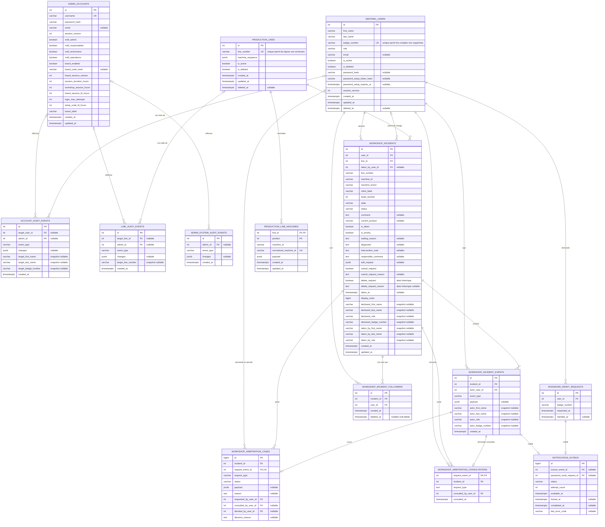
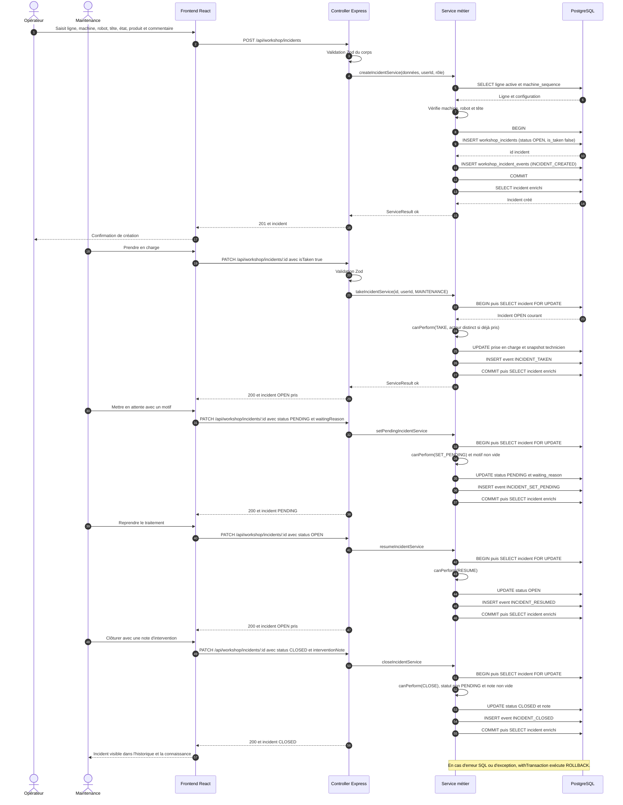
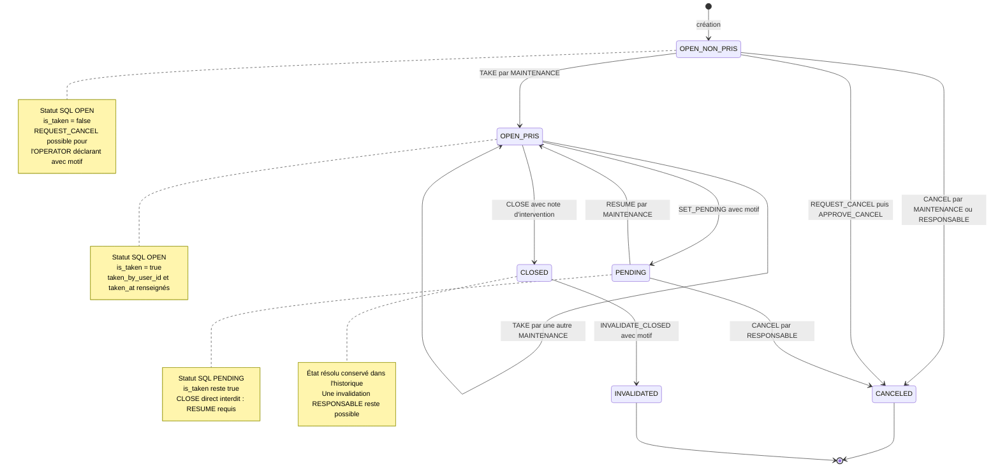
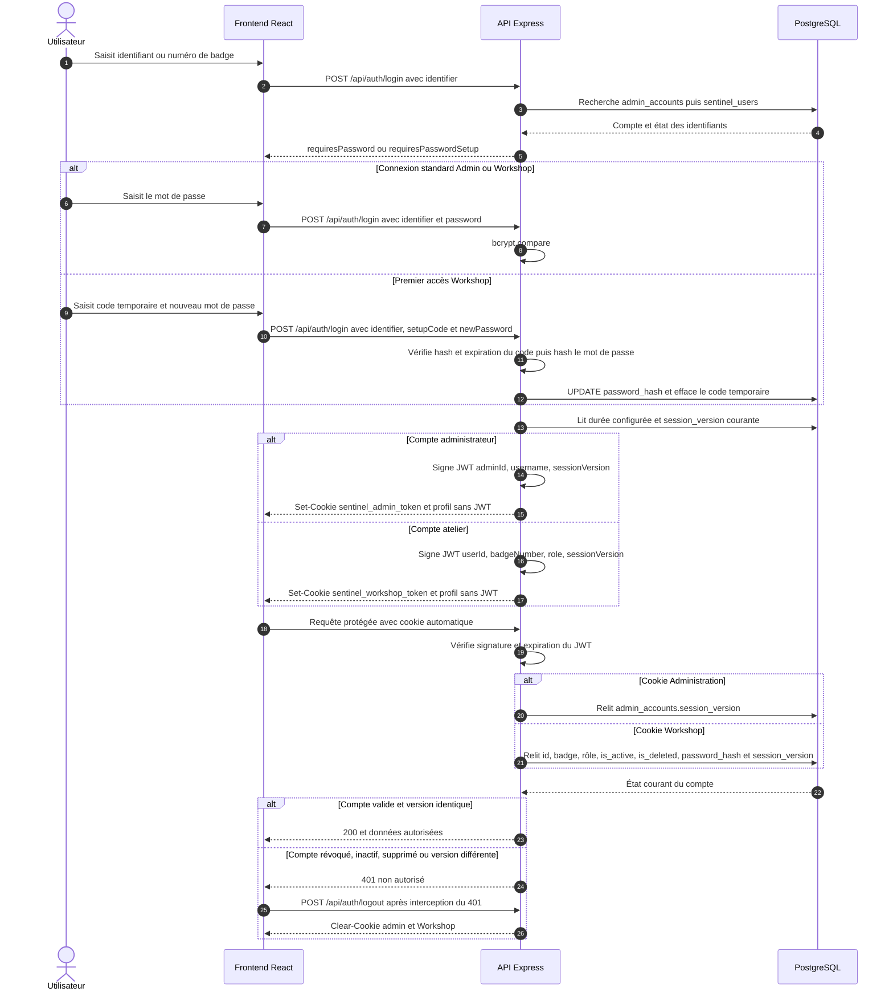
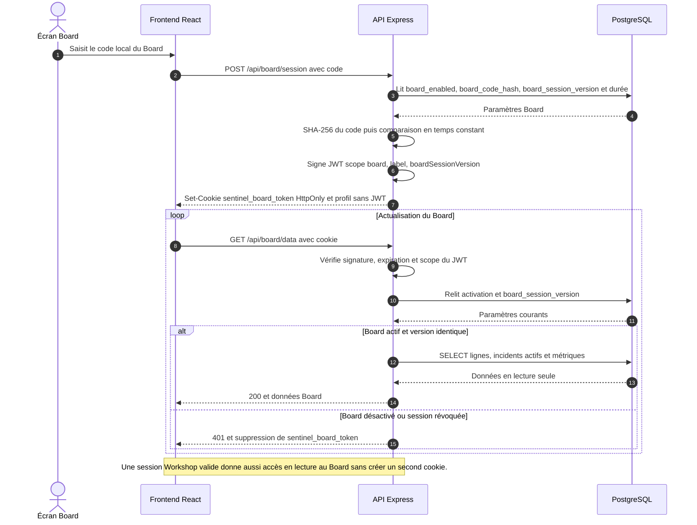

# Schémas Mermaid — Dossier de projet DWWM

> Schémas vérifiés le 28 juillet 2026 à partir des migrations `001` à `050`, des
> routes Express, de `workshop.policy.ts`, des services transactionnels et des
> gardes React du dépôt. Le MCD contient les **quatorze tables applicatives**. La table
> technique `schema_migrations`, créée par le moteur de migration, est volontairement
> exclue du domaine métier.
>
> Le code peut être collé dans [Mermaid Live](https://mermaid.live/) pour un export
> SVG ou PNG. Pour le dossier, privilégier le SVG afin de garder les libellés lisibles.

---

## 1. Modèle conceptuel de données — quatorze tables applicatives (référencé §6.2)

Les cardinalités traduisent la nullabilité réelle des clés étrangères. Par exemple,
`taken_by_user_id`, les cibles des journaux d'administration et `admin_id` sont
facultatifs en base ; le déclarant, la ligne, l'acteur d'un événement et les clés des
tables de suivi ou d'arbitrage sont obligatoires.

### Contraintes physiques structurantes à faire apparaître dans le MPD (§6.4)

- `sentinel_users.role` est limité à `OPERATOR`, `MAINTENANCE` ou `RESPONSABLE` ;
- `workshop_incidents.status` est limité à `OPEN`, `PENDING`, `CLOSED`,
  `CANCELED` ou `INVALIDATED` ;
- `workshop_incidents.state` est limité à `SKIPEE_PAR_MACHINE`,
  `SKIPEE_PAR_CONDUCTEUR`, `DEGRADEE` ou `INDISPONIBLE` ;
- `chk_taken_consistency` synchronise `is_taken`, `taken_by_user_id` et `taken_at` ;
- `chk_pending_must_be_taken` interdit un incident `PENDING` non pris ;
- `chk_edit_request_shape` impose un objet JSON contenant au moins un champ métier connu ;
- l'index unique partiel `idx_unique_active_incident_per_machine` interdit deux
  incidents actifs sur le même emplacement `(line_id, machine_id, robot_label, head_number)` ;
- `workshop_arbitration_consultations.request_event_id` est à la fois sa clé primaire
  et une clé étrangère vers `workshop_incident_events.id` ;
- la suppression d'un incident cascade vers ses événements et consultations
  d'arbitrage ; les relations de suivi vers l'incident et l'utilisateur sont en
  `ON DELETE RESTRICT` ; les autres clés étrangères conservent le comportement
  PostgreSQL par défaut (`NO ACTION`) ;
- les suppressions des comptes et lignes sont logiques. Les snapshots d'identité
  préservent la lisibilité de l'historique après anonymisation ou archivage ;
- `schema_migrations(filename, checksum, applied_at)` est une table technique du
  moteur de migration : elle doit être montrée à part dans le MPD, jamais
  comptée parmi les quatorze tables applicatives.

---

## 2. Diagramme de cas d'utilisation — capacités réelles (référencé §7.1)

Le diagramme représente les capacités métier exposées par les routes et services.
Les conditions fines liées au propriétaire, au statut et à la prise en charge restent
portées par `workshop.policy.ts`.

```mermaid
flowchart LR
    OP((OPERATOR))
    MA((MAINTENANCE))
    RE((RESPONSABLE))
    AD((Administrateur))

    subgraph COMMUN[Atelier - fonctions communes aux trois rôles]
        W1[S'authentifier par badge]
        W2[Créer et consulter des incidents]
        W3[Consulter dashboard, pilotage et historique]
        W4[Consulter la base de connaissance]
        W5[Utiliser l'assistance]
        W6[Consulter le Board en lecture seule]
    end

    subgraph OPERATEUR[Actions OPERATOR]
        O1[Demander la correction de son incident actif]
        O2[Retirer sa demande de correction]
        O3[Demander l'annulation de son incident non pris]
    end

    subgraph MAINT[Actions MAINTENANCE]
        M1[Prendre un incident OPEN ou reprendre celui d'un autre technicien]
        M2[Modifier un incident non pris ou pris par soi]
        M3[Mettre en attente avec diagnostic]
        M4[Reprendre un incident PENDING]
        M5[Clôturer avec note d'intervention]
        M6[Annuler directement un incident actif non pris]
    end

    subgraph RESPONSABLE[Actions RESPONSABLE]
        R1[Modifier un incident actif]
        R2[Approuver ou refuser une correction]
        R3[Approuver ou refuser une annulation]
        R4[Définir la priorité et la consigne]
        R5[Suivre ou ne plus suivre un incident actif]
        R6[Consulter le Journal et les arbitrages]
        R7[Annuler un incident non pris ou PENDING]
        R8[Invalider une clôture avec motif]
    end

    subgraph ADMIN[Administration]
        A1[S'authentifier comme administrateur]
        A2[Gérer comptes, activation et accès atelier]
        A3[Gérer lignes et référentiel machines]
        A4[Traiter les demandes de réinitialisation]
        A5[Consulter qualité, audit référentiel et audit système]
        A6[Gérer sécurité, courriel et mot de passe admin]
        A7[Configurer sessions, notifications et Board]
        A8[Utiliser l'assistance administrateur]
    end

    OP --> W1
    OP --> W2
    OP --> W3
    OP --> W4
    OP --> W5
    OP --> W6
    OP --> O1
    OP --> O2
    OP --> O3

    MA --> W1
    MA --> W2
    MA --> W3
    MA --> W4
    MA --> W5
    MA --> W6
    MA --> M1
    MA --> M2
    MA --> M3
    MA --> M4
    MA --> M5
    MA --> M6

    RE --> W1
    RE --> W2
    RE --> W3
    RE --> W4
    RE --> W5
    RE --> W6
    RE --> R1
    RE --> R2
    RE --> R3
    RE --> R4
    RE --> R5
    RE --> R6
    RE --> R7
    RE --> R8

    AD --> A1
    AD --> A2
    AD --> A3
    AD --> A4
    AD --> A5
    AD --> A6
    AD --> A7
    AD --> A8
```

> Le Board accepte soit une session Board locale obtenue par code, soit une session
> Workshop valide. Il ne crée ni ne modifie d'incident. L'administrateur peut activer
> ou désactiver cet accès, renouveler son code et révoquer les sessions Board.

---

## 3. Diagramme de séquence — workflow nominal complet (référencé §7.2)

Chaque mutation est réalisée dans une transaction. La lecture `FOR UPDATE`, la
vérification par `canPerform`, la mutation et l'insertion de l'événement appartiennent
au même bloc transactionnel ; une exception provoque un `ROLLBACK`.

---

## 4. Diagramme d'états — cycle de vie de l'incident (référencé §7.3)

`OPEN_NON_PRIS` et `OPEN_PRIS` sont deux situations métier du même statut SQL
`OPEN`, distinguées par `is_taken`. Les demandes de correction et d'annulation
n'ajoutent pas un statut : elles restent des données d'arbitrage sur l'incident actif.

---

## 5. Flux d'authentification JWT et cookies (référencé §10.3)

### 5.1 Comptes Administration et Workshop

La réponse JSON ne contient jamais le JWT. Le navigateur le reçoit uniquement dans
un cookie `HttpOnly`. En production, les cookies sont aussi `Secure` et `SameSite=Strict`.

### 5.2 Session locale du Board

---

## Sources de vérification dans le dépôt

- structure et contraintes : `backend/migrations/001_create_admin_accounts.sql` à
  `backend/migrations/038_create_workshop_arbitration_consultations.sql` ;
- routes : `backend/src/server.ts`, `backend/src/modules/*/*.routes.ts` et
  `backend/src/modules/board/board.auth.ts` ;
- permissions : `backend/src/modules/workshop/workshop.policy.ts` ;
- transactions et événements : `backend/src/db/transaction.ts`,
  `backend/src/modules/workshop/workshop.service.edit.ts`,
  `backend/src/modules/workshop/workshop.service.mutations.ts` et
  `backend/src/modules/workshop/workshop.events.ts` ;
- sessions : `backend/src/modules/auth/`, `backend/src/middlewares/adminAuth.ts`,
  `backend/src/middlewares/workshopAuth.ts` et `backend/src/auth/authCookies.ts` ;
- routes d'interface : `frontend/src/App.tsx`, `frontend/src/routes/AdminRoute.tsx`,
  `frontend/src/routes/WorkshopRoute.tsx` et
  `frontend/src/routes/WorkshopResponsableRoute.tsx`.
